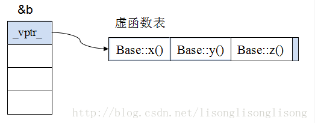

<!-- vim-markdown-toc GFM -->

* [内存布局和分配方式](#内存布局和分配方式)
	* [C程序的内存布局如下：](#c程序的内存布局如下)
	* [程序加载时的内存分布](#程序加载时的内存分布)
	* [C++程序的内存布局与C程序布局类似](#c程序的内存布局与c程序布局类似)
	* [内存溢出原因](#内存溢出原因)
		* [栈溢出：](#栈溢出)
		* [堆溢出：](#堆溢出)
	* [内存泄露和检测](#内存泄露和检测)
	* [动态内存泄露检测：](#动态内存泄露检测)
	* [结构体内存对齐问题？结构体/类大小的计算？](#结构体内存对齐问题结构体类大小的计算)
	* [程序生成过程](#程序生成过程)
	* [预编译](#预编译)
	* [头文件的作用](#头文件的作用)
* [基本数据类型和用法知识](#基本数据类型和用法知识)
	* [函数调用的过程？](#函数调用的过程)
	* [int fun() 和 int fun(void)的区别?](#int-fun-和-int-funvoid的区别)
	* [在C中用const 能定义真正意义上的常量吗？C++中的const呢？](#在c中用const-能定义真正意义上的常量吗c中的const呢)
	* [struct与class的区别](#struct与class的区别)
	* [struct与union的区别](#struct与union的区别)
	* [const和define的用途以及区别](#const和define的用途以及区别)
	* [枚举和define的区别](#枚举和define的区别)
	* [内联函数和宏的区别](#内联函数和宏的区别)
	* [new/delete和malloc/free的区别](#newdelete和mallocfree的区别)
	* [delete和delete[]的区别](#delete和delete的区别)
	* [指针和引用的概念和区别](#指针和引用的概念和区别)
	* [数组、指针 & 引用](#数组指针--引用)
	* [智能指针](#智能指针)
	* [memset，memcpy和strcpy的区别](#memsetmemcpy和strcpy的区别)
	* [指针在###位机，###位机，###位机中分别占多大内存](#指针在位机位机位机中分别占多大内存)
	* [C++中四种类型转换是：static_cast, dynamic_cast, const_cast, reinterpret_cast](#c中四种类型转换是static_cast-dynamic_cast-const_cast-reinterpret_cast)
	* [字符指针,浮点数指针和函数指针哪个占用内存更大](#字符指针浮点数指针和函数指针哪个占用内存更大)
	* [如何引用一个全局变量](#如何引用一个全局变量)
	* [变量声明和定义的区别](#变量声明和定义的区别)
	* [野指针,未初始化指针和空指针的区别](#野指针未初始化指针和空指针的区别)
	* [常量指针和指针常量的区别](#常量指针和指针常量的区别)
	* [指针函数和函数指针的区别](#指针函数和函数指针的区别)
	* [const char``*``, char const``*``, char``*`` const的区别](#const-char-char-const-char-const的区别)
	* [static全局变量与普通的全局变量的区别](#static全局变量与普通的全局变量的区别)
	* [static局部变量和普通局部变量的区别](#static局部变量和普通局部变量的区别)
	* [static类成员](#static类成员)
	* [sizeof用在不同对象上的区别](#sizeof用在不同对象上的区别)
	* [sizeof与strlen的区别](#sizeof与strlen的区别)
	* [空指针指向了内存的什么地方](#空指针指向了内存的什么地方)
	* [<font color=red>有一个char``*`` 型指针刚好指向一些int 型变量, 我想跳过它们。为什么((int ``*``)p)++; 不行？</font>](#font-colorred有一个char-型指针刚好指向一些int-型变量-我想跳过它们为什么int-p-不行font)
	* [c++中的四个智能指针： shared_ptr,unique_ptr,weak_ptr,auto_ptr](#c中的四个智能指针-shared_ptrunique_ptrweak_ptrauto_ptr)
	* [函数指针](#函数指针)
	* [下面四个代码的区别，常量区的右值不可改变](#下面四个代码的区别常量区的右值不可改变)
	* [C++里是怎么定义常量的？常量存放在内存的哪个位置？](#c里是怎么定义常量的常量存放在内存的哪个位置)
	* [C语言是怎么进行函数调用的？](#c语言是怎么进行函数调用的)
	* [C++如何处理返回值？](#c如何处理返回值)
	* [C++中拷贝赋值函数的形参能否进行值传递？](#c中拷贝赋值函数的形参能否进行值传递)
	* [malloc与new区别](#malloc与new区别)
	* [fork,wait,exec函数的作用](#forkwaitexec函数的作用)
	* [C++类的内部可以定义引用数据成员吗？](#c类的内部可以定义引用数据成员吗)
	* [什么是右值引用，跟左值又有什么区别？](#什么是右值引用跟左值又有什么区别)
	* [include头文件的顺序以及双引号””和尖括号<>的区别？](#include头文件的顺序以及双引号和尖括号的区别)
	* [什么时候会发生段错误？](#什么时候会发生段错误)
	* [assert()](#assert)
	* [#pragma pack(n)](#pragma-packn)
	* [extern "C"](#extern-c)
	* [struct 和 typedef struct](#struct-和-typedef-struct)
	* [union联合体](#union联合体)
	* [explicit（显式）关键字](#explicit显式关键字)
	* [:: 范围解析运算符](#-范围解析运算符)
	* [enum枚举类型](#enum枚举类型)
	* [decltype关键字](#decltype关键字)
	* [引用和宏](#引用和宏)
	* [必须使用成员初始化列表的场合](#必须使用成员初始化列表的场合)
	* [内存分配和管理](#内存分配和管理)
	* [delete this 合法吗？](#delete-this-合法吗)
	* [如何定义一个只能在堆上（栈上）生成对象的类？](#如何定义一个只能在堆上栈上生成对象的类)
	* [new delete和malloc free的联系和区别](#new-delete和malloc-free的联系和区别)
	* [vector与list的区别](#vector与list的区别)
	* [vector的底层实现](#vector的底层实现)
	* [vector扩容原理说明](#vector扩容原理说明)
	* [函数参数压栈方式为什么是从右到左的？](#函数参数压栈方式为什么是从右到左的)
	* [动态库和静态库对比](#动态库和静态库对比)
	* [C++中``*``和&同时使用是什么意思?](#c中和同时使用是什么意思)
	* [黑盒测试与白盒测试](#黑盒测试与白盒测试)
	* [一个空类class中有什么?](#一个空类class中有什么)
	* [hash冲突及解决方法](#hash冲突及解决方法)
* [面向对象知识](#面向对象知识)
	* [哪些函数不能成为虚函数？](#哪些函数不能成为虚函数)
	* [计算类大小例子](#计算类大小例子)
	* [为什么析构函数必须是虚函数？为什么C++默认的析构函数不是虚函数](#为什么析构函数必须是虚函数为什么c默认的析构函数不是虚函数)
	* [friend友元类和友元函数](#friend友元类和友元函数)
	* [面向对象三大特征](#面向对象三大特征)
	* [虚析构函数](#虚析构函数)
	* [纯虚函数](#纯虚函数)
	* [虚继承](#虚继承)
	* [虚继承、虚函数](#虚继承虚函数)
	* [模板类、成员模板、虚函数](#模板类成员模板虚函数)
	* [抽象类、接口类、聚合类](#抽象类接口类聚合类)
	* [继承含有纯虚函数的父类，子类能否实例化？](#继承含有纯虚函数的父类子类能否实例化)
	* [构造函数是否可以用private修饰，如果可以，会有什么效果？](#构造函数是否可以用private修饰如果可以会有什么效果)
	* [子类的指针能否转换为父类的指针？父类指针能否访问子类成员？](#子类的指针能否转换为父类的指针父类指针能否访问子类成员)
	* [构造函数和析构函数能被继承吗?](#构造函数和析构函数能被继承吗)
	* [构造函数能不能是虚函数？](#构造函数能不能是虚函数)
	* [构造函数和析构函数能不能被重载？](#构造函数和析构函数能不能被重载)
	* [面向对象三个基本特点](#面向对象三个基本特点)
	* [什么是多态？多态有什么用途？](#什么是多态多态有什么用途)
	* [override 和 final 关键字](#override-和-final-关键字)
	* [空类默认的成员函数](#空类默认的成员函数)
	* [默认构造函数](#默认构造函数)
	* [类的成员函数重载、覆盖和隐藏的概念和区别](#类的成员函数重载覆盖和隐藏的概念和区别)
	* [类成员初始化顺序](#类成员初始化顺序)
	* [虚函数表：](#虚函数表)
	* [纯虚函数：](#纯虚函数-1)
	* [什么是虚函数？什么是纯虚函数？](#什么是虚函数什么是纯虚函数)
	* [基类为什么需要虚析构函数？](#基类为什么需要虚析构函数)
	* [基类和子类的构造、析构顺序](#基类和子类的构造析构顺序)
	* [深拷贝与浅拷贝的区别](#深拷贝与浅拷贝的区别)
	* [构造函数的特点](#构造函数的特点)
	* [析构函数的特点](#析构函数的特点)
	* [公有继承、私有继承、受保护的继承](#公有继承私有继承受保护的继承)
	* [<font color=red>类成员中只能使用构造函数的初始化列表而不能赋值的有哪些</font>](#font-colorred类成员中只能使用构造函数的初始化列表而不能赋值的有哪些font)
	* [函数模板与类模板的区别](#函数模板与类模板的区别)
	* [引用与多态的关系](#引用与多态的关系)
	* [static成员变量和static成员函数](#static成员变量和static成员函数)
	* [static总结](#static总结)
	* [const总结](#const总结)
	* [C++中成员函数能够同时用static和const进行修饰？](#c中成员函数能够同时用static和const进行修饰)
* [STL标准库](#stl标准库)
	* [STL](#stl)
	* [vector的reserve和capacity的区别？](#vector的reserve和capacity的区别)
	* [容器选择](#容器选择)
	* [vector中v[i]与v.at(i)的区别](#vector中vi与vati的区别)
* [使用场景](#使用场景)
	* [virtual, inline, decltype,volatile,static, const关键字的作用？使用场景？](#virtual-inline-decltypevolatilestatic-const关键字的作用使用场景)

<!-- vim-markdown-toc -->

## 内存布局和分配方式
### C程序的内存布局如下：
1. 静态存储区：存储全局变量和static变量，通常在程序编译期间已经分配好了。
	1. BSS段：存放未初始化的static变量和全局变量
	2. Data段：存放初始化过的static变量和全局变量
	3. Text段：存储程序的二进制代码，程序代码区。　　
2. 堆：程序运行时通过malloc申请的内存区存放在堆中，需要使用free来释放该内存空间，生存期在malloc和free之间。
3. 栈：执行函数时，函数的局部变量存储在栈中，执行结束后自动释放该内存区域，栈内存分配运算内置与处理器指令集中。

### 程序加载时的内存分布
	在多任务操作系统中，每个进程都运行在一个属于自己的虚拟内存中，而虚拟内存被分为许多页，并映射到物理内存中，被加载到物理内存中的文件才能够被执行。这里
我们主要关注程序被装载后的内存布局，其可执行文件包含了代码段，数据段，BSS段，堆，栈等部分，其分布如下图所示。

	- 代码段(.text)：用来存放可执行文件的机器指令。存放在只读区域，以防止被修改。
	- 只读数据段(.rodata)：用来存放常量存放在只读区域，如字符串常量、全局const变量等。
	- 可读写数据段(.data)：用来存放可执行文件中已初始化全局变量，即静态分配的变量和全局变量。
	- BSS段(.bss)：未初始化的全局变量和局部静态变量以及初始化为0的全局变量一般放在.bss的段里，以节省内存空间。eg:static int a=0;(初始化为0的全局变量（静态
		变量）放在.bss)。
	- 堆：用来容纳应用程序动态分配的内存区域。当程序使用malloc或new分配内存时，得到的内存来自堆。堆通常位于栈的下方。
	- 栈：用于维护函数调用的上下文。栈通常分配在用户空间的最高地址处分配。
	- 动态链接库映射区：如果程序调用了动态链接库，则会有这一部分。该区域是用于映射装载的动态链接库。
	- 保留区：内存中受到保护而禁止访问的内存区域。

### C++程序的内存布局与C程序布局类似
1. 区别是C++不再区分全局变量和静态变量是否已经初始化，全部存储在静态存储区；
2. 另外堆中存放new/delete申请释放的资源，而malloc和free申请的资源存放在自由存储区。

### 内存溢出原因
#### 栈溢出：
1. 越界访问造成，例如局部变量数组越界访问或者函数内局部变量使用过多，超出了操作系统为该进程分配的栈的大小，
还有递归函数层次过多超过了栈大小。

#### 堆溢出：
1. 程序申请了资源但忘记释放该资源，造成内存泄露，累积泄露内存过多会造成内存溢出。

### 内存泄露和检测
1. C++内存泄漏检测内存泄露是指程序中动态分配了内存，但是在程序结束时没有释放这部分内存,
从而造成那一部分内存不可用的情况。

### 动态内存泄露检测：
1. 检查new/delete的资源是否正确释放，检查程序运行期间内存是否一直在增长，使用内存检测工具来检测泄露情况。

2. VS下检测内存泄漏的方法

	```
	#define CRTDBG_MAP_ALLOC    
	#include <stdlib.h>
	#include <crtdbg.h>
	//在入口函数中包含 _CrtDumpMemoryLeaks();
	//即可检测到内存泄露

	//以如下测试函数为例：  
	int main()
	{
		char* pChars = new char[10];
		//delete[]pChars;
		_CrtDumpMemoryLeaks();
		system("pause");
		return 0;
	}
	```

	1. 解决方法：

	  - 养成良好的编码习惯和规范，记得及时释放掉内存或系统资源。
	  - 重载new和delete，以链表的形式自动管理分配的内存。
	  - 使用智能指针，share_ptr、auto_ptr、weak_ptr。

### 结构体内存对齐问题？结构体/类大小的计算？
1. 内存对齐是看类型，而不是看总的字节数。比如：

```
#include<iostream>
using namespace std;

struct AlignData1
{
    int a;
    char b[7];//a后面并不会补上3个字节，而是由于char的类型所以不用补。
    short c;
    char d;
}Node;
struct AlignData2
{
    bool a;
    int b[2];//a后面并不会补上7个字节，而是根据int的类型补3个字节。
    int c;
    int d;
}Node2;
int main(){
    cout << sizeof(Node) << endl;//16
    cout << sizeof(Node2) << endl;//20
    system("pause");
    return 0;
}

```

2. 补充：

	1. 每个成员相对于这个结构体变量地址的偏移量正好是该成员类型所占字节的整数倍。
		为了对齐数据，可能必须在上一个数据结束和下一个数据开始的地方插入一些没有用处字节。

	2. 最终占用字节数为成员类型中最大占用字节数的整数倍。
	
	3. 一般的结构体成员按照默认对齐字节数递增或是递减的顺序排放，会使总的填充字节数最少。

	```
	struct AlignData1
	{
		char c;
		short b;
		int i;
		char d;
	}Node;

	```

	这个结构体在编译以后，为了字节对齐，会被整理成这个样子：
	```
	struct AlignData1
	{
		char c;
		char padding[1];
		short b;
		int i;
		char d;
		char padding[3];
	}Node;

	```

3. 联合体的大小计算：

	1. 联合体所占的空间不仅取决于最宽成员，还跟所有成员有关系，即其大小必须满足两个条件：
		1. 大小足够容纳最宽的成员；
		2. 大小能被其包含的所有基本数据类型的大小所整除。

		```
		union U1
		{
			int n;
			char s[11];
			double d;
		};  //16，char s[11]按照char=1可以整除

		union U2
		{
			int n;
			char s[5];
			double d;
		};  //8

		```

### 程序生成过程
1. 预处理阶段：根据文件中的预处理指令来修改源文件的内容。如#include指令，作用是把头文件的内容添加到.cpp文件中。
2. 编译阶段：将其翻译成等价的中间代码或汇编代码。
3. 汇编阶段：把汇编语言翻译成目标机器指令。
4. 链接阶段：例如，某个源文件中的函数可能引用了另一个源文件中定义的某个函数；在程序中可能调用了某个库文件中的函数。

### 预编译
1. 定义：预编译又称为预处理 , 是做些代码文本的替换工作。处理 # 开头的指令 , 比如拷贝 #include 包含的文件代码， 
	#define 宏定义的替换 , 条件编译等。

2. 功能：宏定义，文件包含，条件编译。

### 头文件的作用
1. 保存程序的声明。

2. 通过头文件可以来调用库函数。
	因为有些代码不能向用户公布，只要向用户提供头文件和二进制的库即可。
	用户只需要按照头文件中的接口声明来调用库功能，**编译器会从库中提取相应的代码。**

3. 如果某个接口被实现或被使用时，其方式与头文件中的声明不一致，编译器就会指出错误，
	这一简单的规则能大大减轻程序员调试、改错的负担。

## 基本数据类型和用法知识
### 函数调用的过程？
1. 如下结构的代码，

```
int main(void)
{
  ...
  d = fun(a, b, c);
  cout<<d<<endl;
  ...
  return 0;
}

```

2. 调用fun()的过程大致如下：
	1. main()========
	2. 参数拷贝（压栈），注意顺序是从右到左，即c-b-a；
	3. 保存d = fun(a, b, c)的下一条指令，即``cout<<d<<endl``（实际上是这条语句对应的汇编指令的起始位置）;
	4. 跳转到fun()函数，注意，到目前为止，这些都是在main()中进行的；
	5. fun()=====
	6. 移动ebp、esp形成新的栈帧结构;
	7. 压栈（push）形成临时变量并执行相关操作;
	8. return一个值;
	9. 出栈（pop）;
	10. 恢复main函数的栈帧结构;
	11. 返回main函数;
	12. main()========
	13. 。。。

### int fun() 和 int fun(void)的区别?
1. 这里考察的是c 中的默认类型机制。
	1. 在c中，int fun() 会解读为返回值为int(即使前面没有int，也是如此，但是在c++中如果没有返回类型将报错)，输入类型和个数没有限制，而int fun(void)则限制输
		入类型为一个void。
	2. 在c++下，这两种情况都会解读为返回int类型，输入void类型。

### 在C中用const 能定义真正意义上的常量吗？C++中的const呢？
1. 不能。
	- c中的const仅仅是从编译层来限定，不允许对const 变量进行赋值操作，**在运行期是无效的**，所以并非是真正的常量（比如
		通过指针对const变量是可以修改值的），

	- 但是c++中是有区别的，c++在编译时会把const常量加入符号表，以后（仍然在编译期）遇到这个变量会从符号表中查找，所以在C++中是不可能修改到const变量的。

2. 补充：
	1. c中的局部const常量存储在栈空间，全局const常量存在只读存储区，所以全局const常量也是无法修改的，它是一个只读变量。
	2. 这里需要说明的是，常量并非仅仅是不可修改，**而是相对于变量，它的值在编译期已经决定，而不是在运行时决定**。
	3. c++中的const 和宏定义是有区别的，宏是在预编译期直接进行文本替换，而const发生在编译期，是可以进行类型检查和作用域检查的。
	4. **语言中只有enum可以实现真正的常量。**
	5. **c++中只有用字面量初始化的const常量会被加入符号表，而变量初始化的const常量依然只是只读变量。**
	6. c++中const成员为只读变量，可以通过指针修改const成员的值，另外const成员变量只能在初始化列表中进行初始化。


3. 下面我们通过代码来看看区别。
	
	1. 同样一段代码，在c编译器下，打印结果为*pa = 4， 4

	2. 在c++编译下打印的结果为 *pa = 4， 8

	```
	int main(void)
	{
		const int a = 8;
		int *pa = (int *)&a;
		*pa = 4;
		printf("*pa = %d, a = %d", *pa, a);
		return 0;
	}

	另外值得一说的是，由于c++中const常量的值在编译期就已经决定，下面的做法是OK的，但是c中是编译通不过的。

	int main(void)
	{
		const int a = 8;
		const int b = 2;
		int array[a+b] = {0};
		return 0;
	}

	```

### struct与class的区别
1. 默认情况下，struct的成员变量是public的，而class是private的。
2. struct保证成员按照声明顺序在内存中存储，而class不能保证。
3. 默认情况下，struct是public继承，而class是private继承。

### struct与union的区别
1. struct中各个成员变量是独立的，union中的成员变量共享同一片内存区域，内存区域长度由成员变量中长度最大的一个决定。
2. struct不能保证分配的是连续内存，但union分配的是连续内存。

### const和define的用途以及区别
1. const用途：用来定义常量、修饰函数参数、修饰函数返回值，可以避免被修改，提高程序的健壮性。
2. define用途：是宏定义，在编译的时候会进行替换，这样做的话可以避免没有意义的数字或字符串，便于程序的阅读。
3. 区别：const定义的数据有数据类型，而宏常量没有数据类型。编译器可以对const常量进行类型检查。
	而对宏定义只进行字符替换，没有类型安全检查，所以字符替换时可能出错。

1.编译器处理方式 
	- define – 在预处理阶段进行替换 
	- const – 在编译时确定其值

2.类型检查 
	- define – 无类型，不进行类型安全检查，可能会产生意想不到的错误 
	- const – 有数据类型，编译时会进行类型检查

3.内存空间 
	- define – 不分配内存，给出的是立即数，有多少次使用就进行多少次替换，在内存中会有多个拷贝，消耗内存大 
	- const – 在静态存储区中分配空间，在程序运行过程中内存中只有一个拷贝

4.其他 
	- 在编译时，编译器通常不为const常量分配存储空间，**而是将它们保存在符号表中，这使得它成为一个编译期间的常量**，没有了存储与读内存的操作，
		使得它的效率也很高。 
	- 宏替换只作替换，不做计算，不做表达式求解。

### 枚举和define的区别
1. #define 是在预编译阶段进行简单替换。枚举常量则是在编译的时候确定其值。
2. 一般在编译器里，可以调试枚举常量，但是不能调试宏常量。
3. 枚举可以一次定义大量相关的常量，而#define 宏一次只能定义一个。

### 内联函数和宏的区别
1. 内联函数在编译时展开，宏在预编译时展开。
2. 在编译的时候内联函数可以直接被嵌入到目标代码中，而宏只是一个简单的文本替换，
	内联函数可以完成诸如类型检测、语句是否正确等编译功能，宏就不具备这样的功能。
3. inline函数是函数，宏不是函数。　　 

### new/delete和malloc/free的区别
1. new/delete用调用**构造函数来实例化对象和调用析构函数释放对象申请的资源**。
2. malloc/free用来申请内存和释放内存，但是申请和释放的对象只能是内**部数据类型**。
3. malloc与free是C++/C语言的**标准库函数**，new/delete是C++的运算符。
4. new是运算符，malloc()是一个库函数；
5. new会调用构造函数，malloc不会；
6. new返回指定类型指针，malloc返回void``*``指针，需要强制类型转换；
7. new会自动计算需分配的空间，malloc不行；
8. new可以被重载，malloc不能。

### delete和delete[]的区别
1. delete只会调用一次析构函数，**delete[]会调用每一个成员的析构函数**。
2. delete与new配套，delete []与new []配套，用new分配的内存用delete删除用new[]分配的内存用delete[]删除。

### 指针和引用的概念和区别
1. 指针和引用的区别
	1. 本质上的区别是，指针是一个新的变量，只是这个变量存储的是另一个变量的地址，我们通过访问这个地址来修改变量。
	2. 而引用只是一个别名，还是变量本身。对引用进行的任何操作就是对变量本身进行操作，因此以达到修改变量的目的。
	3. 其他
		1. 指针：指针是一个变量，只不过这个变量存储的是一个地址，指向内存的一个存储单元；
		2. 而引用跟原来的变量实质上是同一个东西，只不过是原变量的一个别名而已。如：

			```
			int a=1;int *p=&a;
			int a=1;int &b=a;

			```

			上面定义了一个整形变量和一个指针变量p，该指针变量指向a的存储单元，即p的值是a存储单元的地址。

			**而下面2句定义了一个整形变量a和这个整形a的引用b，事实上a和b是同一个东西，在内存占有同一个存储单元。**

2. **引用在创建的同时必须初始化，保证引用的对象是有效的，所以不存在NULL引用。**

3. 指针在定义的时候不必初始化，所以，指针则可以是NULL，可以在定义后面的任何地方重新赋值。

4. **引用一旦被初始化为指向一个对象，它就不能被改变为另一个对象的引用**。

5. 指针在任何时候都可以改变为指向另一个对象。

6. **引用的创建和销毁并不会调用类的拷贝构造函数。**

7. 因为不存在空引用，并且引用一旦被初始化为指向一个对象，它就不能被改变为另一个对象的引用，所以比指针安全。
	由于const 指针仍然存在空指针，并且有可能产生野指针，所以还是不安全。

8. <font color=red>程序会给指针变量分配内存区域，而引用不需要分配内存区域。</font>

9. <font color=red>返回引用时，在内存中不产生被返回值的副本。</font>

10. 可以有const指针，但是没有const引用（const引用可读不可改，与绑定对象是否为const无关）
	- 引用可以指向常量，也可以指向变量。例如int &a=b，使引用a指向变量b。而为了让引用指向常量，必须使用常量引用，如const int &a=1; 
	- 它代表的是引用a指向一个const int型，这个int型的值不能被改变，而不是引用a的指向不能被改变，因为引用的指向本来就是不可变的，无需加const声明。
	- 即指针存在常量指针int const *p和指针常量int *const p，而引用只存在常量引用int const &a，不存在引用常量int& const a。

11. 指针可以有多级，但是引用只能是一级（int ```**p```；合法而 int &&a是不合法的）

12. sizeof引用得到的是所指向的变量(对象)的大小，而sizeof指针得到的是指针本身的大小；sizeof 对数组，得到整个数组所占空间大小.

13. 指针和引用的自增(++)运算意义不一样；

14. 指针使用时需要解引用（*），引用则不需要；

### 数组、指针 & 引用
1. 指针和引用的区别？
	1. 相同点：
		1. 都是地址的概念；
		2. 都是“指向”一块内存。指针指向一块内存，它的内容是所指内存的地址；而引用则是某块内存的别名；
		3. 引用在内部实现其实是借助指针来实现的，一些场合下引用可以替代指针，比如作为函数形参。

	2. 不同点：
		1. 指针是一个实体，而引用(看起来，这点很重要)仅是个别名；
		2. 引用只能在定义时被初始化一次，之后不可变；指针可变；引用“从一而终”，指针可以“见异思迁”；
		3. 引用不能为空，指针可以为空；
		4. “sizeof 引用”得到的是所指向的变量(对象)的大小，而“sizeof 指针”得到的是指针本身的大小；
		5. 指针和引用的自增(++)运算意义不一样；
		6. 引用是类型安全的，而指针不是 (引用比指针多了类型检查)
		7. 引用具有更好的可读性和实用性。

2. 引用占用内存空间吗？
	如下代码中对引用取地址，其实是取的引用所对应的内存空间的地址。这个现象让人觉得引用好像并非一个实体。
	但是引用是占用内存空间的，而且其占用的内存和指针一样，因为引用的内部实现就是通过指针来完成的。

	1. 比如 Type& name； <===> Type* const name。

	```
	int main(void)
	{
			int a = 8;
			const int &b = a;
			int *p = &a;
			*p = 0;
			cout<<a; //output 0
		return 0;
	}

	```

3. 三目运算符
	在C中三目运算符(? :)的结果仅仅可以作为右值，比如如下的做法在C编译器下是会报错的，但是C++中却是可以是通过的。
这个进步就是通过引用来实现的，因为下面的三目运算符的返回结果是一个引用，然后对引用进行赋值是允许的。

```
int main(void)
{
	int a = 8;
	int b = 6;
	(a>b ? a : b) = 88;
	cout<<a; //output 88
    return 0;
}
```

4. 指针数组和数组指针的区别
	数组指针，是指向数组的指针，而指针数组则是指该数组的元素均为指针。

	1. 数组指针，是指向数组的指针，其本质为指针，形式如下。
	如 int (*p)[10]，p即为指向数组的指针，()优先级高，首先说明p是一个指针，指向一个整型的一维数组，
	这个一维数组的长度是n，也可以说是p的步长。也就是说执行p+1时，p要跨过n个整型数据的长度。数组指针是指向数组首元素的地址的指针，
	其本质为指针，可以看成是二级指针。

	```
	类型名 (*数组标识符)[数组长度]
	```		

	2. 指针数组，在C语言和C++中，数组元素全为指针的数组称为指针数组，其中一维指针数组的定义形式如下。
	指针数组中每一个元素均为指针，其本质为数组。如 int *p[n]， []优先级高，先与p结合成为一个数组，再由int*说明这是一个整型指针数组，
	它有n个指针类型的数组元素。这里执行p+1时，则p指向下一个数组元素，这样赋值
    是错误的：p=a；因为p是个不可知的表示，只存在p[0]、p[1]、p[2]…p[n-1],而且它们分别是指针变量可以用来存放变量地址。但可以这样 *p=a; 这里*p表示指针数组
    第一个元素的值，a的首地址的值。

	```
	类型名 *数组标识符[数组长度]
	```

### 智能指针
1. 智能指针是在 <memory> 头文件中的std命名空间中定义的，该指针用于确保程序不存在内存和资源泄漏且是异常安全的。它们对RAII“获取资源即初始化”编程至关重要
    ，RAII的主要原则是为将任何堆分配资源（如动态分配内存或系统对象句柄）的所有权提供给其析构函数包含用于删除或释放资源的代码以及任何相关清理代码的堆栈分
    配对象。大多数情况下，当初始化原始指针或资源句柄以指向实际资源时，会立即将指针传递给智能指针。

2. 智能指针的设计思想：将基本类型指针封装为类对象指针（这个类肯定是个模板，以适应不同基本类型的需求），并在析构函数里编写delete语句删除指针指向的内存空间。

3. unique_ptr只允许基础指针的一个所有者。unique_ptr小巧高效；大小等同于一个指针且支持右值引用，从而可实现快速插入和对STL集合的检索。

4. shared_ptr采用引用计数的智能指针，主要用于要将一个原始指针分配给多个所有者（例如，从容器返回了指针副本又想保留原始指针时）的情况。当所有的shared_ptr
    所有者超出了范围或放弃所有权，才会删除原始指针。大小为两个指针；一个用于对象，另一个用于包含引用计数的共享控制块。最安全的分配和使用动态内存的方法是
    调用make_shared标准库函数，此函数在动态分配内存中分配一个对象并初始化它，返回对象的shared_ptr。

5. 引用计数问题
	- 每个shared_ptr所指向的对象都有一个引用计数，它记录了有多少个shared_ptr指向自己
	- shared_ptr的析构函数：递减它所指向的对象的引用计数，如果引用计数变为0，就会销毁对象并释放相应的内存
	- 引用计数的变化：决定权在shared_ptr，而与对象本身无关

6. 智能指针支持的操作
	- 使用重载的->和*运算符访问对象。
	- 使用get成员函数获取原始指针，提供对原始指针的直接访问。你可以使用智能指针管理你自己的代码中的内存，还能将原始指针传递给不支持智能指针的代码。
	- 使用删除器定义自己的释放操作。
	- 使用release成员函数的作用是放弃智能指针对指针的控制权，将智能指针置空，并返回原始指针。（只支持unique_ptr）
	- 使用reset释放智能指针对对象的所有权。

7. 循环引用
	1. 循环引用”简单来说就是：两个对象互相使用一个shared_ptr成员变量指向对方会造成循环引用。
		即A内部有指向B，B内部有指向A，这样对于A，B必定是在A析构后B才析构，对于B，A必定是在B析构后才析构A，这就是循环引用问题，违反常规，导致内存泄露。

	2. 解决循环引用方法：
		1. 当只剩下最后一个引用的时候需要手动打破循环引用释放对象。
		2. 当A的生存期超过B的生存期的时候，B改为使用一个普通指针指向A。
		3. 使用weak_ptr打破这种循环引用，因为weak_ptr不会修改计数器的大小，所以就不会产生两个对象互相使用一个shared_ptr成员变量指向对方的问题，
			从而不会引起引用循环。

### memset，memcpy和strcpy的区别
1. memset用来对一段内存空间全部设置为某个字符。
2. memcpy是内存拷贝函数，可以拷贝任何数据类型的对象。
3. **strcpy只能拷贝字符串，遇到’\###结束拷贝**。

### 指针在###位机，###位机，###位机中分别占多大内存
1. 16位机：2节。
2. 32位机：4节。
3. 64位机：8节。

### C++中四种类型转换是：static_cast, dynamic_cast, const_cast, reinterpret_cast
1. const_cast:
	1. 特点：去常转换，编译时执行。
	2. 应用场合： const_cast操作不能在不同的种类间转换。相反，它仅仅把它作用的表达式转换成常量。它可以使一个本来不是const类型的数据转换成const类型的，
		或者把const属性去掉。

2. static_cast:
	1. 特点：
		- 静态转换，在编译处理期间。

	2. 应用场景
		1. 主要用于C++中内置的基本数据类型之间的转换，但是没有运行时类型的检测来保证转换的安全性。
		2. 用于基类和子类之间的指针或引用之间的转换，这种转换把子类的指针或引用转换为基类表示是安全的；进行下行转换，把基类的指针或引用转换为子类表示
            时，由于没有进行动态类型检测，所以是不安全的。
		3. 把void类型的指针转换成目标类型的指针（不安全）
		4. 不能用于两个不相关的类型转换
		5. 不能把const对象转换成非const对象

3. dynamic_cast:
    - 用于动态类型转换。只能用于**含有虚函数的类**
    - 用于类层次间的向上(指的是子类向基类的转换)和向下转化(指的是基类向子类的转换)。
    - 只能转指针或引用。 
    - 向下转化时，如果是非法的对于指针返回NULL，对于引用抛异常。 
        它通过判断在执行到该语句的时候变量的运行时类型和要转换的类型是否相同来判断是否能够进行向下转换。 
                               
4. reinterpret_cast:
	1. 特点：重解释类型转换
	2. 应用场合：它有着和c风格强制类型转换同样的功能；它可以转化任何的内置数据类型为其他的类型，同时它也可以把任何类型的指针转化为其他的类型；它的机理
		是对二进制进行重新的解释，不会改变原来的格式。

5. [链接](https://www.cnblogs.com/chio/archive/2007/07/18/822389.html)

6. 补充：static_cast与dynamic_cast
	1. cast发生的时间不同，一个是static编译时，一个是runtime运行时；
	2. static_cast是相当于C的强制类型转换，用起来可能有一点危险，不提供运行时的检查来确保转换的安全性。
	3. dynamic_cast**用于转换指针和和引用**，**不能用来转换对象** ——主要用于类层次间的上行转换和下行转换，还可以用于类之间的交叉转换。
		在类层次间进行上行转换时，dynamic_cast和static_cast的效果是一样的；
		在进行下行转换时，dynamic_cast具有类型检查的功能，比static_cast更安全。
		在多态类型之间的转换主要使用dynamic_cast，因为类型提供了运行时信息。


	```
	#include <iostream>
	using namespace std;
	class CBasic
	{
	public:
		 virtual int test(){return 0;}
	};

	class CDerived : public CBasic
	{
	public:
		 virtual int test(){ return 1;}
	};

	int main()
	{
		 CBasic        cBasic;
		 CDerived    cDerived;
		 CBasic * pB1 = new CBasic;
		 CBasic * pB2 = new CDerived;
		 CBasic * pB3 = new CBasic;
		 CBasic * pB4 = new CDerived;


		 //dynamic cast failed, so pD1 is null. 
		 CDerived * pD1 = dynamic_cast<CDerived * > (pB1);

		 //dynamic cast succeeded, so pD2 points to  CDerived object                                         
		 CDerived * pD2 = dynamic_cast<CDerived * > (pB2);
		 //pD3将是一个指向该CBasic类型对象的指针，对它进行CDerive类型的操作将是不安全的
		 CDerived * pD3 = static_cast<CDerived * > (pB3);
		 //static_cast成功
		 CDerived * pD4 = static_cast<CDerived * > (pB4);

		 //dynamci cast failed, so throw an exception.
	//    CDerived & rD1 = dynamic_cast<CDerived &> (*pB1);

	//dynamic cast succeeded, so rD2 references to CDerived object. 
		 CDerived & rD2 = dynamic_cast<CDerived &> (*pB2);

		 return 0;
	} 

	```

	CBasic要有虚函数，否则会编译出错；static_cast则没有这个限制。

### 字符指针,浮点数指针和函数指针哪个占用内存更大
一样大，指针的占用内存大小只和机器相关。

### 如何引用一个全局变量
1. 在同一文件中：直接引用。
2. 咋不同文件中：直接引用头文件；使用extern声明变量。

### 变量声明和定义的区别
1. 变量声明：告诉编译器有某个类型的变量，但不会为其分配内存。
2. 变量定义：位该类型的变量分配内存。

### 野指针,未初始化指针和空指针的区别
1. 野指针：指向一个已删除的对象或无意义地址的指针。
	1. 原因：指针变量没有被初始化，或者指针p被free或者delete之后，没有置为NULL。　　

2. 空指针：空指针表示“未分配” 或者“尚未指向任何地方” 的指针。
3. 悬空指针：当所指向的对象被释放或者收回，但是没有让指针指向NULL；

4. 区别：空指针可以确保不指向任何对象或函数; 而未野指针或初始化指针则可能指向任何地方。

### 常量指针和指针常量的区别
1. 常量指针：是一个指向常量的指针。可以防止对指针误操作而修改该常量。
2. 指针常量：是一个常量，且是一个指针。指针常量不能修改指针所指向的地址，一旦初始化，地址就固定了，
	不能对它进行移动操作。但是指针常量的内容是可以改变。

### 指针函数和函数指针的区别
1. 指针函数：返回值是指针的函数。
2. 函数指针：一个指向函数的指针。函数名被括号括起来，并且加有指针符号。

### const char``*``, char const``*``, char``*`` const的区别
1. char ``*`` const cp;//cp是常指针，指向char类型的数据
2. const char ``*`` cp;//cp是char类型的指针，指向const char
3. char const ``*`` p;//C++里面没有const``*``的运算符，所以const属于前面的类型。

### static全局变量与普通的全局变量的区别
1. 全局变量在整个工程文件内都有效。
2. 静态全局变量只在定义它的文件内有效。
3. 全局变量和静态变量如果没有手工初始化，则由编译器初始化为###

### static局部变量和普通局部变量的区别
1. 静态局部变量只在定义它的函数内有效，只是程序仅分配一次内存，函数返回后，该变量不会消失，直到程序运行结束后才释放。
2. 普通局部变量在定义它的函数内有效，这个函数返回会后失效。
3. static局部变量会自动初始化，而局部变量不会。

### static类成员
1. 成员变量
	1. 用static修饰类的数据成员实际使其成为类的全局变量，会被类的所有对象共享，包括派生类的对象。
	2. 因此，**static成员必须在类外进行初始化，而不能在构造函数内进行初始化**，不过也可以用const修饰static数据成员在类内初始化。
	3. 因为静态成员属于整个类，而不属于某个对象，**如果在类内初始化，会导致每个对象都包含该静态成员，这是矛盾的**。
	4. <font color=red>c++ 类内定义的都是成员对象，想要定义类对象，需要加上static并且在类外初始化。</font>

	5. 特点：
		1. **不要试图在头文件中定义(初始化)静态数据成员**。在大多数的情况下，这样做会引起重复定义这样的错误。
			**即使加上#ifndef #define #endif或者#pragma once也不行。**

		2. 静态数据成员可以成为成员函数的可选参数，而普通数据成员则不可以。

		3. 静态数据成员的类型可以是所属类的类型，而普通数据成员则不可以。普通数据成员的只能声明为所属类类型的指针或引用。

2. 成员函数
	1. 用static修饰成员函数，使这个类只存在这一份函数，所有对象共享该函数，**不含this指针**。
	2. 静态成员是可以独立访问的，也就是说，无须创建任何对象实例就可以访问。base::func(5,3);当static成员函数在类外定义时不需要加static修饰符。
	3. 在静态成员函数的实现中不能直接引用类中说明的非静态成员，可以引用类中说明的静态成员。因为静态成员函数不含this指针。 
	4. <font color=green>c++中雷内定义的函数默认是对象方法，有this指针。定义为类方法小特别指定static</font>

	5. 不可以同时用const和static修饰成员函数。

		1. C++编译器在实现const的成员函数的时候为了确保该函数不能修改类的实例的状态，会在函数中添加
			一个隐式的参数const this*。

		2. 但当一个成员为static的时候，该函数是没有this指针的。也就是说此时const的用法和static是冲突的。

		3. 我们也可以这样理解：两者的语意是矛盾的。
			1. static的作用是表示该函数只作用在类型的静态变量上，与类的实例没有关系；
			2. 而const的作用是确保函数不能修改类的实例的状态，与类型的静态变量没有关系。因此不能同时用它们。

### sizeof用在不同对象上的区别
1. sizeof是C语言的一种单目操作符，并不是函数。sizeof以字节的形式返回操作数的大小。
2. 若操作数具有类型char、unsigned　char或signed　char，其结果等于###
3. 当操作数是指针时，sizeof依赖于系统的位数。
4. 当操作数具有数组类型时，其结果是数组的总字节数。
5. 联合类型操作数的sizeof是其最大字节成员的字节数。
6. 结构类型操作数的sizeof是这种类型对象的总字节数。
7. 如果操作数是函数中的数组形参或函数类型的形参，sizeof给出其指针的大小。

### sizeof与strlen的区别
1. sizeof是运算符，计算数据所占的内存空间；strlen（）是一个函数，计算字符数组的字符数。

2. sizeof可以用类型作参数；**strlen（）只能用char*作参数，必须是以'/0'结束。**

3. <font color=red>数组做sizeof的参数不退化,传递给strlen就退化为指针了。</font>

4. sizeof操作符的结果类型是size_t，它在头文件中typedef为unsigned　int类型。
	该类型保证能容纳实现建立的最大对象的字节大小。

### 空指针指向了内存的什么地方
1. 标准并没有对空指针指向内存中的什么地方这一个问题作出规定，一般取决于系统的实现。
	我们常见的空指针一般指向0地址，即空指针的内部用全0来表示。

2. 空指针的“逻辑地址”一定是###对于空指针的地址，操作系统是特殊处理的。并非空指针指向一个###址的物理地址。
	在实际编程中不需要了解在我们的系统上空指针到底是一个###针还是非###址，我们只需要了解一个指针
	是否是空指针就可以了——编译器会自动实现其中的转换，为我们屏蔽其中的实现细节。

### <font color=red>有一个char``*`` 型指针刚好指向一些int 型变量, 我想跳过它们。为什么((int ``*``)p)++; 不行？</font>
1. 类型转换的实质“把这些二进制位看作另一种类型, 并作相应的对待”。
2. ((int ``*``)p)++是一个转换操作符, 根据定义它只能生成一个右值(rvalue)。
3. 而右值既不能赋值, 也不能用++ 自增。
4. 正确的做法:p = (char ``*``)((int ``*``)p + 1;。
5. <font color=green>注意，这里对不是数组的指针也进行了加减，还是不同类型的指针，查看这种情况的场景</font>

### c++中的四个智能指针： shared_ptr,unique_ptr,weak_ptr,auto_ptr
1. 智能指针出现的原因：
	1. 智能指针的作用是管理一个指针，因为存在以下这种情况：
		- 申请的空间在函数结束时忘记释放，造成内存泄漏。
	2. 使用智能指针可以很大程度上的避免这个问题，因为智能指针就是一个类，当超出了类的作用域是，类会自动调用析构函数，析构函数会自动释放资源。
	
	3. 所以智能指针的作用原理就是在函数结束时自动释放内存空间，不需要手动释放内存空间。

2. auto_ptr（c++98的方案，c++11已经抛弃）原因是缺乏语言特性如 “针对构造和赋值” 的 std::move 语义，以及其他瑕疵。

3. unique_ptr（替换auto_ptr）：
	- 是 C++11 才开始提供的类型，是一种在异常时可以帮助避免资源泄漏的智能指针。
	- 采用独占式拥有，意味着可以确保一个对象和其相应的资源同一时间只被一个 pointer 拥有。
	- 一旦拥有着被销毁或编程 empty，或开始拥有另一个对象，先前拥有的那个对象就会被销毁，其任何相应资源亦会被释放。
	- 实现独占式拥有（exclusive ownership）或严格拥有（strict ownership）概念，保证同一时间内只有一个智能指针可以指向该对象。
	- 你可以移交拥有权。它对于避免内存泄漏（resource leak）——如 new 后忘记 delete ——特别有用。unique_ptr 用于取代 auto_ptr

4. shared_ptr：
	- shared_ptr实现共享式拥有概念。
	- 多个智能指针指向相同对象，该对象和其相关资源会在 “最后一个 reference 被销毁” 时被释放。
	- 为了在结构较复杂的情景中执行上述工作，标准库提供 weak_ptr、bad_weak_ptr 和 enable_shared_from_this 等辅助类。
	- 多个智能指针可以共享同一个对象，对象的最末一个拥有着有责任销毁对象，并清理与该对象相关的所有资源。

5. weak_ptr：
	- weak_ptr 允许你共享但不拥有某对象，一旦最末一个拥有该对象的智能指针失去了所有权，任何 weak_ptr 都会自动成空（empty）。
	- 因此，在default 和 copy 构造函数之外，**weak_ptr 只提供 “接受一个 shared_ptr” 的构造函数**。
	- 可打破环状引用（cycles of references，两个其实已经没有被使用的对象彼此互指，使之看似还在 “被使用” 的状态）的问题。

### 函数指针

1. 定义：
	- 函数指针是指向函数的指针变量。函数指针本身首先是一个指针变量，该指针变量指向一个具体的函数。
	- 这正如用指针变量可指向整型变量、字符型、数组一样，这里是指向函数。
	- C在编译时，每一个函数都有一个入口地址，该入口地址就是函数指针所指向的地址。
	- 有了指向函数的指针变量后，可用该指针变量调用函数，就如同用指针变量可引用其他类型变量一样，在这些概念上是大体一致的。

2. 用途：调用函数和做函数的参数，比如回调函数。
3. 示例：

```
char * fun(char * p)  {…}       //  指针函数fun
char * (*pf)(char * p);             //  函数指针pf
pf = fun;                        // 函数指针pf指向函数fun
pf(p);                        // 通过函数指针pf调用函数fun

```

### 下面四个代码的区别，常量区的右值不可改变
1. const char * arr = "123"; char * brr = "123"; const char crr[] = "123"; char drr[] = "123";

2. const char * arr = "123"; // 字符串123保存在常量区，const本来是修饰arr指向的值不能通过arr去修改，但是字符串“123”在常量区，
						  //本来就不能改变，所以加不加const效果都一样

3. char * brr = "123"; // 字符串123保存在常量区，这个brr指针指向的是同一个位置，同样不能通过brr去修改"123"的值

4. const char crr[] = "123"; // 这里123本来是在栈上的，但是编译器可能会做某些优化，将其放到常量区

5. char drr[] = "123"; // 字符串123保存在栈区，可以通过drr去修改

### C++里是怎么定义常量的？常量存放在内存的哪个位置？
1. 对于局部常量，存放在栈区；
2. 对于全局常量，编译期一般不分配内存，放在**符号表**中以提高访问效率；
3. 字面值常量，比如字符串，放在常量区。

### C语言是怎么进行函数调用的？
每一个函数调用都会分配函数栈，在栈内进行函数执行过程。调用前，先把返回地址压栈，然后把当前函数的esp指针压栈。

### C++如何处理返回值？
生成一个临时变量，把它的引用作为函数参数传入函数内。

### C++中拷贝赋值函数的形参能否进行值传递？
不能。如果是这种情况下，调用拷贝构造函数的时候，首先要将实参传递给形参，这个传递的时候又要调用拷贝构造函数……如此循环，无法完成拷贝，栈也会满。

### malloc与new区别
malloc需要给定申请内存的大小，返回的指针需要强转；new会调用构造函数，不用指定内存大小，返回的指针不用强转。

### fork,wait,exec函数的作用
1. 父进程产生子进程使用fork拷贝出来一个父进程的副本，此时只拷贝了父进程的页表，两个进程都读同一块内存，当有进程写的时候使用写实拷贝机制分配内存；
2. exec函数可以加载一个elf文件去替换父进程，从此父进程和子进程就可以运行不同的程序了。
3. fork从父进程返回子进程的pid，从子进程返回0；
4. 调用了wait的父进程将会发生阻塞，直到有子进程状态改变,执行成功返回0，错误返回-1。
5. exec执行成功则子进程从新的程序开始运行，无返回值，执行失败返回-1。

### C++类的内部可以定义引用数据成员吗？
1. 可以，必须通过成员函数初始化列表初始化

	```
    class MyClass
    {
    public:
        MyClass(int &i):  a(1),   b(i){         //  构造函数初始化列表中是初始化工作
										        //   在这里做的是赋值而非初始化工作
        }
    private:
        const int a;
        int &b;  // 引用数据成员b,必须通过列表初始化！
    };
	```

2. <font color=red>注意：构造函数初始化列表是初始化，构造函数体是赋值</font>

### 什么是右值引用，跟左值又有什么区别？
1. 左值：
	能对表达式取地址、或具名对象/变量。一般指表达式结束后依然存在的持久对象。

2. 右值：
	不能对表达式取地址，或匿名对象。一般指表达式结束就不再存在的临时对象。

3. 右值引用和左值引用的区别：
	1. 左值可以寻址，而右值不可以；
	2. 左值可以被赋值，右值不可以被赋值，可以用来给左值赋值；
	3. 左值可变,右值不可变（仅对基础类型适用，用户自定义类型右值引用可以通过成员函数改变）。

### include头文件的顺序以及双引号””和尖括号<>的区别？
1. include头文件的顺序：对于include的头文件来说，如果在文件a.h中声明一个在文件b.h中定义的变量，而不引用b.h。
	那么要在a.c文件中引用b.h文件，并且要先引用b.h，后引用a.h,否则汇报变量类型未声明错误。

2. 双引号和尖括号的区别：编译器预处理阶段查找头文件的路径不一样。
	1. 对于使用双引号包含的头文件，查找头文件路径的顺序为：
		当前头文件目录、编译器设置的头文件路径（编译器可使用-I显式指定搜索路径）、系统变量CPLUS_INCLUDE_PATH/C_INCLUDE_PATH指定的头文件路径；

	2. 对于使用尖括号包含的头文件，查找头文件的路径顺序为：
		编译器设置的头文件路径（编译器可使用-I显式指定搜索路径）、系统变量CPLUS_INCLUDE_PATH/C_INCLUDE_PATH指定的头文件路径。

### 什么时候会发生段错误？
1. 段错误通常发生在访问非法内存地址的时候，具体来说分为以下几种情况：
	1. 使用野指针
	2. 试图修改字符串常量的内容

### assert()
1. 断言是宏，而非函数。assert 宏的原型定义在 <assert.h>（C）、<cassert>（C++）中，其作用是如果它的条件返回错误，则终止程序执行。可以通过定义 NDEBUG 来
	关闭 assert，但是需要在源代码的开头，include <assert.h> 之前。

2. assert()使用

	```
	#define NDEBUG          // 加上这行，则 assert 不可用
	#include <assert.h>

	assert( p != NULL );    // assert 不可用
	```

### #pragma pack(n)
1. 用途：设定结构体、联合以及类成员变量以 n 字节方式对齐
2. #pragma pack(n)使用实例：

	```
	#pragma pack(push)  // 保存对齐状态
	#pragma pack(4)     // 设定为 4 字节对齐

	struct test
	{
		char m1;
		double m4;
		int m3;
	};

	#pragma pack(pop)   // 恢复对齐状态
	```

### extern "C"
1. 用途：extern "C" 的作用是让 C++ 编译器将 extern "C" 声明的代码当作 C 语言代码处理，可以避免 C++ 因符号修饰导致代码不能和C语言库中的符号进行链接的问
	题。
2. 被 extern 限定的函数或变量是 extern 类型的；被 extern "C" 修饰的变量和函数是按照 C 语言方式编译和链接的
3. extern "C"实例如下：

```
#ifdef __cplusplus
extern "C" {
#endif

void *memset(void *, int, size_t);

#ifdef __cplusplus
}
#endif
```

### struct 和 typedef struct
1. C语言中：

```
// c
typedef struct Student {
    int age;
} S;
// 等价于下面
struct Student {
    int age;
} ;
typedef struct Student S;

```

2. C++中：
	1. 如果在类标识符空间定义了 struct Student {...};，使用 Student me; 时，编译器将搜索全局标识符表，Student 未找到，则在类标识符内搜索。即表现为可
		以使用 Student 也可以使用 struct Student，如下：

		```
            // cpp
            struct Student {
                int age;
            };

            void f( Student me );       // 正确，"struct" 关键字可省略

		```

	2. 若定义了与 Student 同名函数之后，则 Student 只代表函数，不代表结构体，如下：

		```
            typedef struct Student {
                int age;
            } S;

            void Student() {}           // 正确，定义后 "Student" 只代表此函数

            //void S() {}               // 错误，符号 "S" 已经被定义为一个 "struct Student" 的别名

            int main() {
                Student();
                struct Student me;      // 或者 "S me";
                return 0;
            }

		```

### union联合体
1. 联合（union）是一种节省空间的特殊的类，一个 union 可以有多个数据成员，但是在任意时刻只有一个数据成员可以有值。
	当某个成员被赋值后其他成员变为未定义状态。联合有如下特点：

	- 默认访问控制符为 public
	- 可以含有构造函数、析构函数
	- 不能含有引用类型的成员
	- 不能继承自其他类，不能作为基类
	- 不能含有虚函数
	- 匿名 union 在定义所在作用域可直接访问 union 成员
	- 匿名 union 不能包含 protected 成员或 private 成员
	- 全局匿名联合必须是静态（static）的

2. union使用实例如下：

	```
    #include<iostream>

    union UnionTest {
        UnionTest() : i(10) {};
        int i;
        double d;
    };

    static union {
        int i;
        double d;
    };

    int main() {
        UnionTest u;

        union {
            int i;
            double d;
        };

        std::cout << u.i << std::endl;  // 输出 UnionTest 联合的 10

        ::i = 20;
        std::cout << ::i << std::endl;  // 输出全局静态匿名联合的 20

        i = 30;
        std::cout << i << std::endl;    // 输出局部匿名联合的 30

        return 0;
    }

	```

### explicit（显式）关键字
- explicit 修饰构造函数时，可以防止隐式转换和复制初始化，必须显式初始化
- explicit 修饰转换函数时，可以防止隐式转换，但按语境转换除外
- explicit使用实例如下：

```
struct A
{
    A(int) { }
    operator bool() const { return true; }
};

struct B
{
    explicit B(int) {}
    explicit operator bool() const { return true; }
};

void doA(A a) {}

void doB(B b) {}

int main()
{
    A a1(1);        // OK：直接初始化
    A a2 = 1;       // OK：复制初始化
    A a3{ 1 };      // OK：直接列表初始化
    A a4 = { 1 };       // OK：复制列表初始化
    A a5 = (A)1;        // OK：允许 static_cast 的显式转换
    doA(1);         // OK：允许从 int 到 A 的隐式转换
    if (a1);        // OK：使用转换函数 A::operator bool() 的从 A 到 bool 的隐式转换
    bool a6（a1）;        // OK：使用转换函数 A::operator bool() 的从 A 到 bool 的隐式转换
    bool a7 = a1;       // OK：使用转换函数 A::operator bool() 的从 A 到 bool 的隐式转换
    bool a8 = static_cast<bool>(a1);  // OK ：static_cast 进行直接初始化

    B b1(1);        // OK：直接初始化
    B b2 = 1;       // 错误：被 explicit 修饰构造函数的对象不可以复制初始化
    B b3{ 1 };      // OK：直接列表初始化
    B b4 = { 1 };       // 错误：被 explicit 修饰构造函数的对象不可以复制列表初始化
    B b5 = (B)1;        // OK：允许 static_cast 的显式转换
    doB(1);         // 错误：被 explicit 修饰构造函数的对象不可以从 int 到 B 的隐式转换
    if (b1);        // OK：被 explicit 修饰转换函数 B::operator bool() 的对象可以从 B 到 bool 的按语境转换
    bool b6(b1);        // OK：被 explicit 修饰转换函数 B::operator bool() 的对象可以从 B 到 bool 的按语境转换
    bool b7 = b1;       // 错误：被 explicit 修饰转换函数 B::operator bool() 的对象不可以隐式转换
    bool b8 = static_cast<bool>(b1);  // OK：static_cast 进行直接初始化

    return 0;
}

```

### :: 范围解析运算符
1. 种类：
	1.  全局作用域符（::name）：用于类型名称（类、类成员、成员函数、变量等）前，表示作用域为全局命名空间
	2.  类作用域符（class::name）：用于表示指定类型的作用域范围是具体某个类的
	3.  命名空间作用域符（namespace::name）:用于表示指定类型的作用域范围是具体某个命名空间的

2. 使用实例：

	```
    int count = 0;        // 全局（::）的 count

    class A {
    public:
        static int count; // 类 A 的 count（A::count）
    };

    int main() {
        ::count = 1;      // 设置全局的 count 的值为 1

        A::count = 2;     // 设置类 A 的 count 为 2

        int count = 0;    // 局部的 count
        count = 3;        // 设置局部的 count 的值为 3

        return 0;
    }

	```

### enum枚举类型
1. 限定作用域的枚举类型:

	enum class open_modes { input, output, append };

2. 不限定作用域的枚举类型:

	enum color { red, yellow, green };
	enum { floatPrec = 6, doublePrec = 10 };

### decltype关键字
1. 作用和用法：用于检查实体的声明类型或表达式的类型及值分类。语法：decltype ( expression )
2. decltype实例如下：

	```
    // 尾置返回允许我们在参数列表之后声明返回类型
    template <typename It>
    auto fcn(It beg, It end) -> decltype(*beg)
    {
        // 处理序列
        return *beg;    // 返回序列中一个元素的引用
    }
    // 为了使用模板参数成员，必须用 typename
    template <typename It>
    auto fcn2(It beg, It end) -> typename remove_reference<decltype(*beg)>::type
    {
        // 处理序列
        return *beg;    // 返回序列中一个元素的拷贝
    }

	```

### 引用和宏
1. 左值引用：常规引用，一般表示对象的身份
2. 右值引用：右值引用就是必须绑定到右值（一个临时对象、将要销毁的对象）的引用，一般表示对象的值；右值引用可实现转移语义（Move Sementics）和精确传递（
	Perfect Forwarding），它的主要目的有两个方面：
	1. 消除两个对象交互时不必要的对象拷贝，节省运算存储资源，提高效率。
	2. 能够更简洁明确地定义泛型函数。

3. 引用折叠： X& &、X& &&、X&& & 可折叠成 X&；X&& && 可折叠成 X&&
4. 宏：宏定义可以实现类似于函数的功能，但是它终归不是函数，而宏定义中括弧中的“参数”也不是真的参数，在宏展开的时候对 “参数” 进行的是一对一的替换。

### 必须使用成员初始化列表的场合
1. 好处：更高效：少了一次调用默认构造函数的过程。
2. 有些场合必须要用初始化列表：
	1. 常量成员，因为常量只能初始化不能赋值，所以必须放在初始化列表里面
	2. 引用类型，引用必须在定义的时候初始化，并且不能重新赋值，所以也要写在初始化列表里面
	3. 没有默认构造函数的类类型，因为使用初始化列表可以不必调用默认构造函数来初始化

### 内存分配和管理
1. malloc、calloc、realloc、alloca
	1. malloc：申请指定字节数的内存。申请到的内存中的初始值不确定。
	2. calloc：为指定长度的对象，分配能容纳其指定个数的内存。申请到的内存的每一位（bit）都初始化为 0。
	3. realloc：更改以前分配的内存长度（增加或减少）。当增加长度时，可能需将以前分配区的内容移到另一个足够大的区域，而新增区域内的初始值则不确定。
	4. alloca：在栈上申请内存。程序在出栈的时候，会自动释放内存。但是需要注意的是，alloca 不具可移植性, 而且在没有传统堆栈的机器上很难实现。alloca 不宜
		使用在必须广泛移植的程序中。C99 中支持变长数组 (VLA)，可以用来替代 alloca。

2. malloc和free
	1. 用途：用于分配、释放内存
	2. 使用：
		1. 申请内存，确认是否申请成功

			```
            char *str = (char*) malloc(100);
            assert(str != nullptr);

			```

		2. 释放内存后指针置空

			```
            free(p);
            p = nullptr;
			```

3. new和delete
	1. new / new[]：完成两件事，先底层调用 malloc 分配了内存，然后调用构造函数（创建对象）。
	2. delete/delete[]：也完成两件事，先调用析构函数（清理资源），然后底层调用 free 释放空间。
	3. new 在申请内存时会自动计算所需字节数，而 malloc 则需我们自己输入申请内存空间的字节数。
	4. 使用：

		```
        int main()
        {
            T* t = new T();     // 先内存分配 ，再构造函数
            delete t;           // 先析构函数，再内存释放
            return 0;
        }

		```

### delete this 合法吗？
1. 合法，但是：
	1. 必须保证 this 对象是通过 new（不是 new[]、不是 placement new、不是栈上、不是全局、不是其他对象成员）分配的
	2. 必须保证调用 delete this 的成员函数是最后一个调用 this 的成员函数
	3. 必须保证成员函数的 delete this 后面没有调用 this 了
	4. 必须保证 delete this 后没有人使用了

### 如何定义一个只能在堆上（栈上）生成对象的类？
1. 只能在堆上
	1. 方法：将析构函数设置为私有
	2. 原因：C++ 是静态绑定语言，编译器管理栈上对象的生命周期，编译器在为类对象分配栈空间时，会先检查类的析构函数的访问性。若析构函数不可访问，则不能在
		栈上创建对象。

2. 只能在栈上
	1. 方法：将 new 和 delete 重载为私有
	2. 原因：在堆上生成对象，使用 new 关键词操作，其过程分为两阶段：第一阶段，使用 new 在堆上寻找可用内存，分配给对象；第二阶段，调用构造函数生成对象。
		将 new 操作设置为私有，那么第一阶段就无法完成，就不能够在堆上生成对象。

### new delete和malloc free的联系和区别
1. malloc与free是C语言的标准库函数， new/delete是C++的运算符。它们都可用于申请动态内存和释放内存;

2. 对于非内部数据类型的对象而言，光用maloc/free无法满足动态对象的要求。对象在创建的同时要自动执行造函数，对象在消亡之前要自动执行析构函数。

3. 由于malloc/free是库函数而不是运算符，不在编译器控制权限之内，不能够把执行构造函数和析构函数的任务强加于malloc/free;

4. C++语言需要一个能完成动态内存分配和初始化工作的运算符new，以一个能完成清理与释放内存工作的运算符delete，注意new/delete不是库函数。

### vector与list的区别
1. vector拥有一段连续的内存空间，因此支持随机存取。
	1. **如果需要高效的随机读，而不在乎插入和删除的效率，使用vector。**
	2. vector和数组类似，它拥有一段连续的内存空间，并且起始地址不变，因此它能非常好的支持随机存取，但由于它的内存空间是连续的，
		所以在中间进行插入和删除会造成内存块的拷贝。另外，当该数组后的内存空间不够时，需要重新申请一块足够大的内存并进行内存的拷贝，这影响vector的效率。

2. list拥有一段不连续的内存空间，因此不支持随机存取。
	1. 如果需要大量的插入和删除，而不关心随机存取，则应使用list。
	2. list是由数据结构中的双向链表实现的，因此它的内存空间可以是不连续的。因此只能通过指针来进行数据的访问，
		这个特点使得它的随机存取变得非常没有效率，需要遍历中间的元素。但由于链表的特点，它可以很好的效率支持任意地方的删除和插入。

### vector的底层实现
1. vector的底层数据结构是一个**动态数组**。
2. 默认构造的大小是0，之后插入按照1 2 4 8 16二倍扩容。扩容后是一片新的内存，需要把旧内存空间中的所有元素都拷贝进新内存空间中去，
3. 之后再在新内存空间中的原数据的后面继续进行插入构造新元素，并且同时释放旧内存空间。
4. 并且，由于vector空间的重新配置，导致旧vector的所有迭代器都失效了。
5. vector的初始的扩容方式代价太大，初始扩容效率低，需要频繁增长。
6. 不仅操作效率比较低，而且频繁的向操作系统申请内存容易造成过多的内存碎片，所以这个时候需要合理使用resize()和reserve()方法提高效率减少内存碎片。

### vector扩容原理说明
1. 新增元素：Vector通过一个连续的数组存放元素，如果集合已满，在新增数据的时候，就要分配一块更大的内存，
	将原来的数据复制过来，释放之前的内存，在插入新增的元素；
	
2. 对vector的任何操作，一旦引起空间重新配置，指向原vector的所有迭代器就都失效了；
3. 初始时刻vector的capacity为0，塞入第一个元素后capacity增加为1；
4. 不同的编译器实现的扩容方式不一样，VS2015中以1.5倍扩容，GCC以2倍扩容。
5. vector在push_back以成倍增长可以在均摊后达到O(1)的事件复杂度，相对于增长指定大小的O(n)时间复杂度更好。
6. 为了防止申请内存的浪费，现在使用较多的有2倍与1.5倍的增长方式，而1.5倍的增长方式可以更好的实现对内存的重复利用，因为更好。

### 函数参数压栈方式为什么是从右到左的？
因为C++支持可变函数参数。正是这个原因使得C语言函数参数入栈顺序是从右到左。具体是:C方式参数入栈顺序的好处就是可以动态变化参数个数。C程序栈底为高地址
，栈顶为低地址。函数最左边确定的参数在栈上的位置必须是确定的，否则意味着已经确定的参数是不能定位和找到的，这样式无法保证函数正确执行的。衡量参数在栈
上的位置，就是离开确切的函数调用点有多远。已经确定的参数，它在栈上的位置，不应该依赖参数的具体数量，因此参数数量是未知的！所有只有确定的参数最后入栈
才能保证它在栈中的位置是确定的。

### 动态库和静态库对比
1. 静态库：静态库对函数库的链接是放在编译的链接时期完成的，程序在运行时与函数库没有关系，便于移植。
	缺点是：浪费空间和资源，因为所有相关的目标文件与牵涉到的函数库被链接合成一个可执行文件。文件后缀常为(.a、.lib)

2. 动态库：动态库把对一些库函数的链接载入推迟到程序运行的时期。可以实现进程间的资源共享，将一些程序升级变的简单，直接更改动态库即可。
	文件后缀常为(.s0、.dll)

### C++中``*``和&同时使用是什么意思?

```
template <class T>
void InsertFront(Node<T>* & head, T item)
```
上面一个函数的声明，其中第一个参数*和&分别是什么意思？
head是个指针，前面为什么加个&

本来“* head”代表的是传指针的，但是只能改变head指向的内容，而“* &head”意思是说head是传进来的指针的同名指针，就能既改变*head指向的内容，又能改变head这个指
针。比如：main()有个Node<int>* p,int t；当调用insertFront(p,t)是，如果template <class T> void InsertFront(Node<T>* & head, T item)中有对head进行赋值改变
时，main()中的p也会跟着改变，如果没有&这个别名标识时，p则不会随着head的改变而改变。

### 黑盒测试与白盒测试
1. 白盒测试：通过程序的源代码进行测试而不使用用户界面。这种类型的测试需要从代码句法发现内部代码在算法、溢出、路径、条件等等中的缺点或者错误，
	进而加以修正。

2. 黑盒测试：通过使用整个软件或某种软件功能来严格地测试, 而并没有通过检查程序的源代码或者很清楚地了解该软件的源代码程序具体是怎样设计的。
	测试人员通过输入他们的数据然后看输出的结果从而了解软件怎样工作。在测试时，把程序看作一个不能打开的黑盆子，
	在完全不考虑程序内部结构和内部特性的情况下，测试者在程序接口进行测试，它只检查程序是否能适当地接收和正确的输出。

### 一个空类class中有什么?
构造函数、拷贝构造函数、析构函数、赋值运算符重载、取地址操作符重载、被const修饰的取地址操作符重载

### hash冲突及解决方法
1. 关键字值不同的元素可能会映射到哈希表的同一地址上就会发生哈希冲突。解决办法：
	1. 开放定址法：
		当冲突发生时，使用某种探查(亦称探测)技术在散列表中形成一个探查(测)序列。沿此序列逐个单元地查找，直到找到给定的关键字，
		或者碰到一个开放的地址(即该地址单元为空)为止（若要插入，在探查到开放的地址，则可将待插入的新结点存人该地址单元）。
		查找时探查到开放的地址则表明表中无待查的关键字，即查找失败。

	2. 再哈希法：同时构造多个不同的哈希函数

	3. 链地址法：将所有哈希地址为 i 的元素构成一个称为同义词链的单链表，并将单链表的头指针存在哈希表的第 i 个
        单元中，因而查找、插入和删除主要在同义词链中进行。链地址法适用于经常进行插入和删除的情况

	4. 建立公共溢出区：将哈希表分为基本表和溢出表两部分，凡是和基本表发生冲突的元素，一律填入溢出表。

## 面向对象知识
### 哪些函数不能成为虚函数？
不能被继承的函数和不能被重写的函数。
1. 普通函数

	普通函数不属于成员函数，是不能被继承的。普通函数只能被重载，不能被重写，因此声明为虚函数没有意义。因为编译器会在编译时绑定函数。
而多态体现在运行时绑定。通常通过基类指针指向子类对象实现多态。

2. 友元函数
友元函数不属于类的成员函数，不能被继承。对于没有继承特性的函数没有虚函数的说法。

3. 构造函数
首先说下什么是构造函数，构造函数是用来初始化对象的。假如子类可以继承基类构造函数，那么子类对象的构造将使用基类的构造函数，而基类构造函数并不知道子类的有
什么成员，显然是不符合语义的。从另外一个角度来讲，多态是通过基类指针指向子类对象来实现多态的，在对象构造之前并没有对象产生，因此无法使用多态特性，这是矛
盾的。因此构造函数不允许继承。

4. 内联成员函数
我们需要知道内联函数就是为了在代码中直接展开，减少函数调用花费的代价。也就是说内联函数是在编译时展开的。而虚函数是为了实现多态，是在运行时绑定的。因此显
然内联函数和多态的特性相违背。

5. 静态成员函数
首先静态成员函数理论是可继承的。但是静态成员函数是编译时确定的，无法动态绑定，不支持多态，因此不能被重写，也就不能被声明为虚函数。

### 计算类大小例子
```
class A {};: sizeof(A) = 1;
class A { virtual Fun(){} };: sizeof(A) = 4(32位机器)/8(64位机器);
class A { static int a; };: sizeof(A) = 1;
class A { int a; };: sizeof(A) = 4;
class A { static int a; int b; };: sizeof(A) = 4;
```
类中用static声明的成员变量不计算入类的大小中，因为static data不是实例的一部分。static的属于全局的，他不会占用类的存储，他有专门的地方存储 （全局变量区）

### 为什么析构函数必须是虚函数？为什么C++默认的析构函数不是虚函数
1. 将可能会被继承的父类的析构函数设置为虚函数，可以保证当我们new一个子类，然后使用基类指针指向该子类对象，释放基类指针时可以释放掉子类的空间，
	防止内存泄漏。
	
2. C++默认的析构函数不是虚函数是因为虚函数需要额外的虚函数表和虚表指针，占用额外的内存。而对于不会被继承的类来说，其析构函数如果是虚函数，就会浪费内存。
	因此C++默认的析构函数不是虚函数，而是只有当需要当作父类时，设置为虚函数。

### friend友元类和友元函数
能访问私有成员、破坏封装性、友元关系不可传递、友元关系的单向性、友元声明的形式及数量不受限制

### 面向对象三大特征
1. 封装：把客观事物封装成抽象的类，并且类可以把自己的数据和方法只让可信的类或者对象操作，对不可信的进行信息隐藏。
	关键字：public, protected, private。不写默认为 private。

	1. public 成员：可以被任意实体访问
	2. protected 成员：只允许被子类及本类的成员函数访问
	3. private 成员：只允许被本类的成员函数、友元类或友元函数访问

2. 继承：基类（父类）——> 派生类（子类）
3. 多态：即多种状态（形态）。简单来说，我们可以将多态定义为消息以多种形式显示的能力。多态是以封装和继承为基础的。
	1. C++ 多态分类及实现：
		1. 重载多态（Ad-hoc Polymorphism，编译期）：函数重载、运算符重载
		2. 子类型多态（Subtype Polymorphism，运行期）：虚函数
		3. 参数多态性（Parametric Polymorphism，编译期）：类模板、函数模板
		4. 强制多态（Coercion Polymorphism，编译期/运行期）：基本类型转换、自定义类型转换

	2. 静态多态(编译期/早绑定)
		1. 函数重载实例:

			```
				class A
				{
				public:
					void do(int a);
					void do(int a, int b);
				};

			```

	3. 动态多态(运行期/晚绑定)
		1. 虚函数：用 virtual 修饰成员函数，使其成为虚函数
		2. 注意：
			1. 普通函数（非类成员函数）不能是虚函数
			2. 静态函数（static）不能是虚函数
			3. 构造函数不能是虚函数（因为在调用构造函数时，虚表指针并没有在对象的内存空间中，必须要构造函数调用完成后才会形成虚表指针）
			4. 内联函数不能是表现多态性时的虚函数

		3. 动态多态实例

		```
            class Shape                     // 形状类
            {
            public:
                virtual double calcArea()
                {
                    ...
                }
                virtual ~Shape();
            };
            class Circle : public Shape     // 圆形类
            {
            public:
                virtual double calcArea();
                ...
            };
            class Rect : public Shape       // 矩形类
            {
            public:
                virtual double calcArea();
                ...
            };
            int main()
            {
                Shape * shape1 = new Circle(4.0);
                Shape * shape2 = new Rect(5.0, 6.0);
                shape1->calcArea();         // 调用圆形类里面的方法
                shape2->calcArea();         // 调用矩形类里面的方法
                delete shape1;
                shape1 = nullptr;
                delete shape2;
                shape2 = nullptr;
                return 0;
            }
		
		```

### 虚析构函数
1. 虚析构函数是为了解决基类的指针指向派生类对象，并用基类的指针删除派生类对象。
2. 虚析构函数的使用如下:

```
    class Shape
    {
    public:
        Shape();                    // 构造函数不能是虚函数
        virtual double calcArea();
        virtual ~Shape();           // 虚析构函数
    };
    class Circle : public Shape     // 圆形类
    {
    public:
        virtual double calcArea();
        ...
    };
    int main()
    {
        Shape * shape1 = new Circle(4.0);
        shape1->calcArea();
        delete shape1;  // 因为Shape有虚析构函数，所以delete释放内存时，先调用子类析构函数，再调用基类析构函数，防止内存泄漏。
        shape1 = NULL;
        return 0；
    }

```

### 纯虚函数
1. 定义：纯虚函数是一种特殊的虚函数，在基类中不能对虚函数给出有意义的实现，而把它声明为纯虚函数，它的实现留给该基类的派生类去做。
2. 用法： virtual int A() = 0;
3. 虚函数：
	1. 类里如果声明了虚函数，这个函数是实现的，哪怕是空实现，它的作用就是为了能让这个函数在它的子类里面可以被覆盖，这样的话，
		编译器就可以使用后期绑定来达到多态了。纯虚函数只是一个接口，是个函数的声明而已，它要留到子类里去实现。

	2. 虚函数在子类里面也可以不重载的；但纯虚函数必须在子类去实现。
	3. 虚函数的类用于 “实作继承”，继承接口的同时也继承了父类的实现。当然大家也可以完成自己的实现。纯虚函数关注的是接口的统一性，实现由子类完成。
	4. 带纯虚函数的类叫抽象类，这种类不能直接生成对象，而只有被继承，并重写其虚函数后，才能使用。抽象类被继承后，子类可以继续是抽象类，也可以是普通类。
	5. 虚基类是虚继承中的基类。

4. 虚函数指针、虚函数表
	1. 虚函数指针：在含有虚函数类的对象中，指向虚函数表，在运行时确定。
	2. 虚函数表：在程序只读数据段，存放虚函数指针，如果派生类实现了基类的某个虚函数，则在虚函数表中覆盖原本基类的那个虚函数指针，
		在编译时根据类的声明创建。

### 虚继承
1. 用途：用于解决多继承条件下的菱形继承问题（浪费存储空间、存在二义性）
2. 底层实现原理与编译器相关，一般通过虚基类指针和虚基类表实现，每个虚继承的子类都有一个虚基类指针（占用一个指针的存储空间，4字节）和虚基类表（不占用类
	对象的存储空间）（需要强调的是，虚基类依旧会在子类里面存在拷贝，只是仅仅最多存在一份而已，并不是不在子类里面了）；当虚继承的子类被当做父类继承时，虚
	基类指针也会被继承。实际上，vbptr 指的是虚基类表指针（virtual base table pointer），该指针指向了一个虚基类表（virtual table），虚表中记录了虚基类与
	本类的偏移地址；通过偏移地址，这样就找到了虚基类成员，而虚继承也不用像普通多继承那样维持着公共基类（虚基类）的两份同样的拷贝，节省了存储空间。

### 虚继承、虚函数
1. 相同点：都利用了虚指针（均占用类的存储空间）和虚表（均不占用类的存储空间）
2. 不同点：
	1. 虚继承：
		1. 虚基类依旧存在继承类中，只占用存储空间
		2. 虚基类表存储的是虚基类相对直接继承类的偏移

	2. 虚函数：
		1. 虚函数不占用存储空间
		2. 虚函数表存储的是虚函数地址

### 模板类、成员模板、虚函数
1. 模板类中可以使用虚函数
2. 一个类（无论是普通类还是类模板）的成员模板（本身是模板的成员函数）不能是虚函数

### 抽象类、接口类、聚合类
1. 抽象类：含有纯虚函数的类
2. 接口类：仅含有纯虚函数的抽象类
3. 聚合类：用户可以直接访问其成员，并且具有特殊的初始化语法形式。满足如下特点：
	1. 所有成员都是 public
	2. 没有定义任何构造函数
	3. 没有类内初始化
	4. 没有基类，也没有 virtual 函数

### 继承含有纯虚函数的父类，子类能否实例化？
1. 如果父类中存在纯虚函数，子类继承父类时，必须重写父类的纯虚函数，函数名、返回类型、参数个数和类型都不能改。
2. 若父类中的虚函数自己有定义，子类也可以不重写。之后便可以实例化子类。

### 构造函数是否可以用private修饰，如果可以，会有什么效果？
1. 如果一个类的构造函数只有一个且为private，这是可以编译通过的；
2. 如果一个类的构造函数只有一个且是private，如果类的内部没有专门创建实例的代码，则是无法创建任何实例的；
3. 如果一个类的构造函数只有一个且是private，如果类的内部有专门创建实例的代码，则只能创建一个或多个实例（根据类内部声明的成员对象个数来定）；
4. 如果一个类的构造函数不止一个，private 构造函数如果参数为void(无参)，则子类无法编译；换言之，如果一个类构造函数只有private且存在子类，则无法编译，除
	非父类构造函数为public。

### 子类的指针能否转换为父类的指针？父类指针能否访问子类成员？
1. 当自己的类指针指向自己类的对象时，无论调用的是虚函数还是实函数，其调用的都是自己的
2. 当指向父类对象的父类指针被强制转换成子类指针时候，子类指针调用函数时，只有非重写函数是自己的，虚函数是父类的；
3. 当指向子类对象的子类指针被强制转换成父类指针的时候，也就是父类指针指向子类对象，此时，父类指针调用的虚函数都是子类的，而非虚函数都是自己的；

### 构造函数和析构函数能被继承吗?
1. 不能。不是所有的函数都能自动地从基类继承到派生类中的。
2. 构造函数和析构函数是用来处理对象的创建和析构的，它们只知道对在它们的特殊层次的对象做什么。所以，在整个层次中的所有的构造函数和析构函数都必须被调用，
	也就是说，构造函数和析构函数不能被继承。子类的构造函数会显示的调用父类的构造函数或隐式的调用父类的默认的构造函数进行父类部分的初始化。
3. 析构函数也一样。它们都是每个类都有的东西，如果能被继承，那就没有办法初始化了。

### 构造函数能不能是虚函数？
1. 不能。
	1. 创建一个对象必须明确指出它的类型，否则无法创建，一个对象创建成功编译器获得它的实际类型，然后去调用对应的函数，而如果构造函数声明为虚函数，会
    形成一个死锁，虚函数是在运行才能确定确定其调用哪一个类型的函数，而具体哪一个类型是编译器通过对象的类型去确定的，但是此时对象还未创建也就没法知道其真
    实类型。
	2. 虚函数对应一张虚函数表，这个虚函数表是存储在对象的内存空间的，如果构造函数是虚函数就需要通过虚函数表来调用，可是对象还没有实例化，也就是内
    存空间还没有，找不到虚函数表，所以构造函数是不能声明为虚函数的。

### 构造函数和析构函数能不能被重载？
构造函数可以被重载，析构函数不可以被重载。因为构造函数可以有多个且可以带参数，而析构函数只能有一个，且不能带参数。

### 面向对象三个基本特点
1. 封装：将客观事物抽象成类，每个类对自身的数据和方法。封装可以使得代码模块化，目的是为了代码重用。
2. 继承：子类继承父类的方法和属性，继承可以扩展已存在的代码，目的是为了代码重用。
3. 多态：通过继承同一个基类，产生了相关的不同的派生类，与基类中同名的成员函数在不同的派生类中会有不同的实现，
	也就是说：一个接口、多种方法。

### 什么是多态？多态有什么用途？
1. C++ 多态有两种：静态多态（早绑定）、动态多态（晚绑定）。静态多态是通过函数重载实现的；动态多态是通过虚函数实现的。
	- 多态也可以分为静态多态和动态多态，静态多态主要是重载，在编译的时候就已经确定；动态多态是用虚函数机制实现的，在运行期间动态绑定。

2. 定义：“一个接口，多种方法”，程序在运行时才决定要调用的函数。
3. 实现：C++多态性主要是通过虚函数实现的，虚函数允许子类重写override(注意和overload的区别，overload是重载，是允许同名函数的表现，
	这些函数参数列表/类型不同）。

4. 注：多态与非多态的实质区别就是**函数地址是静态绑定还是动态绑定**。
	1. 如果函数的调用在**编译器编译期间**就可以确定函数的调用地址，并产生代码，说明地址是静态绑定的；
	2. 如果函数调用的地址是 **需要在运行期间才确定，属于动态绑定。**

5. 目的：接口重用。封装可以使得代码模块化，继承可以扩展已存在的代码，他们的目的都是为了代码重用。而多态的目的则是为了接口重用。

6. 用法：声明基类的指针，利用该指针指向任意一个子类对象，调用相应的虚函数，可以根据指向的子类的不同而实现不同的方法。

7. 用一句话概括：
	在基类的函数前加上virtual关键字，在派生类中重写该函数，运行时将会根据对象的实际类型来调用相应的函数。
	如果对象类型是派生类，就调用派生类的函数；如果对象类型是基类，就调用基类的函数。

8. 虚函数的实现：
	- 在有虚函数的类中，类的最开始部分是一个虚函数表的指针，这个指针指向一个虚函数表，表中放了虚函数的地址，实际的虚函数在代码段(.text)中。
	- 当子类继承了父类的时候也会继承其虚函数表，当子类重写父类中虚函数时候，会将其继承到的虚函数表中的地址替换为重新写的函数地址。
	- 使用了虚函数，会增加访问内存开销，降低效率。

### override 和 final 关键字
1. 如果不使用override，当你手一抖，将foo()写成了f00()会怎么样呢？结果是编译器并不会报错，因为它并不知道你的目的是重写虚函数，而是把它当成了新的函数。
  如果这个虚函数很重要的话，那就会对整个程序不利。所以，override的作用就出来了，它指定了子类的这个虚函数是重写的父类的，
  如果你名字不小心打错了的话，编译器是不会编译通过的：*/

2. 当不希望某个类被继承，或不希望某个虚函数被重写，可以在类名和虚函数后添加final关键字，添加final关键字后被继承或重写，编译器会报错。例子如下：*/
	1. 只有虚函数才需要final，不是虚函数的方法不能用final，因为它本身就不可以override。

### 空类默认的成员函数
1. 默认构造函数
2. 析构函数
3. 复制构造函数
4. 赋值运算符

### 默认构造函数
1. 什么时候生成默认构造函数（无参构造函数）？什么时候生成默认拷贝构造函数？什么是深拷贝？什么是浅拷贝？默认拷贝构造函数是哪种拷贝？什么时候用深拷贝？
	1. 没有任何构造函数时，编译器会自动生成默认构造函数，也就是无参构造函数；当类没有拷贝构造函数时，会生成默认拷贝构造函数。
	2. 深拷贝是指拷贝后对象的逻辑状态相同，而浅拷贝是指拷贝后对象的物理状态相同；默认拷贝构造函数属于浅拷贝。
	3. 当系统中有成员指代了系统中的资源时，需要深拷贝。比如指向了动态内存空间，打开了外存中的文件或者使用了系统中的网络接口等。如果不进行深拷贝，比如动
	态内存空间，可能会出现多次被释放的问题。是否需要定义拷贝构造函数的原则是，是类是否有成员调用了系统资源，如果定义拷贝构造函数，一定是定义深拷贝，否则
	没有意义。

### 类的成员函数重载、覆盖和隐藏的概念和区别
1. 重载是指再**同一个作用域内**，有几个**同名的函数**，**但是参数列表的个数和类型不同**。

2. 函数覆盖是指**派生类函数覆盖基类函数**，**函数名、参数类型、返回值类型一模一样**。
	派生类的对象会调用子类中的覆盖版本，覆盖父类中的函数版本。

3. 隐藏是指派生类的函数屏蔽了与其同名的基类函数。

4. 覆盖和隐藏的区别：
	1. 派生类的函数与基类的函数同名，但是参数不同。此时，不论有无virtual关键字，基类的函数将被隐藏。
	2. 派生类的函数与基类的函数同名，参数也相同。**基类函数有virtual，是覆盖，没有virtual就是隐藏**。

5. Overload(重载)：在C++程序中，可以将语义、功能相似的几个函数用同一个名字表示，但参数（包括类型、顺序不同），即函数重载。
	1. 相同的范围（在同一个类中）；
	2. 函数名字相同；
	3. 参数不同；
	4. virtual 关键字可有可无。

5. Override(覆盖或重写)：是指派生类函数覆盖基类函数，特征是：
	1. 不同的范围（分别位于派生类与基类）；
	2. 函数名字相同；
	3. 参数相同；
	4. 基类函数必须有virtual 关键字。

6. 重写基类虚函数的时候，会自动转换这个函数为virtual函数，不管有没有加virtual，因此重写的时候不加virtual也是可以的，不过为了易读性，还是加上比较好。

7. Overwrite(重写)：隐藏，是指派生类的函数屏蔽了与其同名的基类函数，规则如下：
	1. 如果派生类的函数与基类的函数同名，但是参数不同。此时，不论有无virtual关键字，基类的函数将被隐藏（注意别与重载混淆）。
	2. 如果派生类的函数与基类的函数同名，并且参数也相同，但是基类函数没有virtual关键字。此时，基类的函数被隐藏（注意别与覆盖混淆）。

### 类成员初始化顺序
1. C++类中数据成员初始化顺序？

	1. 成员变量在使用初始化列表初始化时，与构造函数中初始化成员列表的顺序无关，只与定义成员变量的顺序有关。

	2. 如果不使用初始化列表初始化，在构造函数内初始化时，此时与成员变量在构造函数中的位置有关。

	3. 类中const成员常量必须在构造函数初始化列表中初始化。

	4. 类中static成员变量，只能在类内外初始化(同一类的所有实例共享静态成员变量)。

2. 初始化顺序：
	1. 基类的静态变量或全局变量

	2. 派生类的静态变量或全局变量

	3. 基类的成员变量

	4. 派生类的成员变量

### 虚函数表：
1. 多态是由虚函数实现的，而虚函数主要是通过虚函数表（V-Table）来实现的。
	- 如果一个类中包含虚函数（virtual修饰的函数），那么这个类就会包含一张虚函数表，虚函数表存储的每一项是一个虚函数的地址。如下图：
		

	- 这个类的每一个**对象**都会包含一个**虚指针**（虚指针存在于对象实例地址的最前面，保证虚函数表有最高的性能），这个虚指针指向虚函数表。
	- **注：对象不包含虚函数表，只有虚指针，类才包含虚函数表，派生类会生成一个兼容基类的虚函数表。**

2. 原始基类的虚函数表
	下图是原始基类的对象，可以看到虚指针在地址的最前面，指向基类的虚函数表（假设基类定义了3个虚函数）

	

3. 单继承时的虚函数（无重写基类虚函数）
	1. 假设现在派生类继承基类，并且重新定义了3个虚函数，派生类会自己产生一个兼容基类虚函数表的属于自己的虚函数表。

		
　　  
	2. Derive Class继承了Base Class中的3个虚函数，准确说是该函数的实体地址被拷贝到Derive Class的虚函数列表中，派生新增的虚函数置于虚函数列表后面，并按声
明顺序摆放。

4. 单继承时的虚函数（重写基类虚函数）
	现在派生类重写基类的x函数，可以看到这个派生类构建自己的虚函数表的时候，修改了base::x()这一项，指向了自己的虚函数。

	

5. 多重继承时的虚函数（class Derived :public Base1,public Base2）
	1. 这个派生类多重继承了两个基类base1，base2，因此它有两个虚函数表。

		

	2. 它的对象会有多个虚指针（据说和编译器相关），指向不同的虚函数表。

	3. 注：**有关以上虚函数表等详见c++对象模型。链接地址：https://www.cnblogs.com/inception6-lxc/p/9273918.html**

### 纯虚函数：
1. 定义：在很多情况下，基类本身生成对象是不合情理的。为了解决这个问题，方便使用类的多态性，引入了纯虚函数的概念
2. 将函数定义为纯虚函数（方法：virtualReturnType Function()= 0;）**纯虚函数不能再在基类中实现**，编译器要求在派生类中必须予以重写以实现多态性。
3. **同时含有纯虚拟函数的类称为抽象类，它不能生成对象。称带有纯虚函数的类为抽象类**。
4. 特点：
	1. 当想在基类中抽象出一个方法，且该基类只做能被继承，而不能被实例化；（避免类被实例化且在编译时候被发现，可以采用此方法）
	2. 这个方法必须在派生类(derived class)中被实现；
	3. 目的：使派生类仅仅只是继承函数的接口。

### 什么是虚函数？什么是纯虚函数？
1. 虚函数是允许被其子类重新定义的成员函数。

2. 虚函数的声明：virtual returntype func(parameter);引入虚函数的目的是为了动态绑定；

3. 纯虚函数声明：virtual returntype func(parameter)=0；引入纯虚函数是为了派生接口。（使派生类仅仅只是继承函数的接口）

### 基类为什么需要虚析构函数？
1. 防止内存泄漏。想去借助父类指针去销毁子类对象的时候，不能去销毁子类对象。
	假如没有虚析构函数，释放一个由基类指针指向的派生类对象时，不会触发动态绑定，则只会调用基类的析构函数，不会调用派生类的。
	派生类中申请的空间则得不到释放导致内存泄漏。

### 基类和子类的构造、析构顺序
1. 定义一个对象时先调用基类的构造函数、然后调用派生类的构造函数
2. 先派生类的析构后基类的析构，也就是说在基类的的析构调用的时候,派生类的信息已经全部销毁了

### 深拷贝与浅拷贝的区别
1. 深拷贝意味着拷贝了资源和指针

2. 浅拷贝只是拷贝了指针，没有拷贝资源

3. 什么时候用到拷贝函数？
	1. 一个对象以值传递的方式传入函数体； 
	2. 一个对象以值传递的方式从函数返回；
	3. 一个对象需要通过另外一个对象进行初始化。
	4. 如果在类中没有显式地声明一个拷贝构造函数，那么，编译器将会自动生成一个默认的拷贝构造函数，该构造函数完成对象之间的位拷贝。位拷贝又称浅拷贝；

4. 是否应该自定义拷贝函数？
	自定义拷贝构造函数是一种良好的编程风格，它可以阻止编译器形成默认的拷贝构造函数，提高源码效率。

5. 什么叫深拷贝？什么是浅拷贝？两者异同？
  如果一个类拥有资源，当这个类的对象发生复制过程的时候，资源重新分配，这个过程就是深拷贝，反之，没有重新分配资源，就是浅拷贝。

6. 深拷贝好还是浅拷贝好？
	如果实行位拷贝，也就是把对象里的值完全复制给另一个对象，如A=B。这时，如果B中有一个成员变量指针已经申请了内存，
	那A中的那个成员变量也指向同一块内存。这就出现了问题：当B把内存释放了（如：析构），这时A内的指针就是野指针了，出现运行错误。

### 构造函数的特点
1. 构造函数只在建立对象的时候自动被调用一次

2. **构造函数必须是公共的**，否则无法生成对象

3. 构造函数只负责为自己的类构造对象　

### 析构函数的特点
1. 函数名称固定：~类名( )
2. 没有返回类型，没有参数
3. **不可以重载**，一般由系统自动的调用

### 公有继承、私有继承、受保护的继承
1. 公有继承时，派生类对象可以访问基类中的公有成员，派生类的成员函数可以访问基类中的公有和受保护成员；
	公有继承时基类受保护的成员，可以通过派生类对象访问但不能修改。

2. 私有继承时，基类的成员只能被直接派生类的成员访问，无法再往下继承。

3. 受保护继承时，基类的成员也只被直接派生类的成员访问，无法再往下继承。

### <font color=red>类成员中只能使用构造函数的初始化列表而不能赋值的有哪些</font>
1. const成员
2. 引用成员

### 函数模板与类模板的区别
1. 函数模板是模板的一种，可以生成各种类型的函数实例，函数模板的实例化是由编译程序在处理函数调用时自动完成的

2. 类模板的实例化必须由程序员在程序中显式地指定。

### 引用与多态的关系
1. 引用就是对象的别名。
2. 引用主要用作函数的形参。
3. 引用必须用与该引用同类型的对象初始化：引用是除指针外另一个可以产生多态效果的手段。
4. <font color=red>一个基类的引用可以指向它的派生类实例。</font>

### static成员变量和static成员函数
1. static数据成员独立于该类的任意对象而存在。

2. **static数据成员（const static数据成员除外）在类定义体内声明，必须在类外进行初始化。**

3. static const 的整型（bool,char,int, long)可以在类中声明且初始化。static const的其他类型必须在类外初始化(包括整型数组)

3. **static数据成员定义放在cpp文件中，不能放在初始化列表中**。

4. **static成员函数在类的外部定义**。

5. Static成员函数没有this形参。

6. **可以直接访问所属类的static成员，不能直接使用非static成员。**

7. <font color=red>因为static成员不是任何对象的组成部分，所以static成员函数不能被声明为const。</font>

8. <font color=red>static成员函数也不能被声明为虚函数。</font>

### static总结
1. 函数体内static变量的作用范围为该函数体，不同于auto变量，该变量的内存只被分配一次，
	因此其值在下次调用时仍维持上次的值。

2. 在模块内的static全局变量可以被模块内所用函数访问，但不能被模块外其它函数访问。

3. 在模块内的static函数只可被这一模块内的其它函数调用，这个函数的使用范围被限制在声明它的模块内。

4. 在类中的static成员变量属于整个类所拥有，对类的所有对象只有一份拷贝。

5. 在类中的static成员函数属于整个类所拥有，这个函数不接收this指针，因而只能访问类的static成员变量。

### const总结

1. 欲阻止一个变量被改变，可以使用const关键字。
	在定义该const变量时，通常需要对它进行初始化，因为以后就没有机会再去改变它了。

2. 对指针来说，可以指定指针本身为const，也可以指定指针所指的数据为const，或二者同时指定为const。
3. 在一个函数声明中，const可以修饰形参，表明它是一个输入参数，在函数内部不能改变其值。
4. 对于类的成员函数，若指定其为const类型，则表明其是一个常函数，不能修改类的成员变量。
5. 对于类的成员函数，有时候必须指定其返回值为const类型，以使得其返回值不为“左值”。

### C++中成员函数能够同时用static和const进行修饰？
不能。
1. C++编译器在实现const的成员函数（const加在函数右边）的时候为了确保该函数不能修改类的中参数的值，会在函数中添加一个隐式的参数const this*。
	但当一个成员为static的时候，该函数是没有this指针的。也就是说此时const的用法和static是冲突的。

2. 即：static修饰的函数表示该函数是属于类的，而不是属于某一个对象的，没有this指针。const修饰的函数表示该函数不能改变this中的内容，
会有一个隐含的const this指针。两者是矛盾的。

## STL标准库

### STL
1. 容器：主要的七种容器 vector,list,deque,map,multimap,set,multiset。
2. 算法
3. 迭代器

### vector的reserve和capacity的区别？
1. reserve()用于让容器预留空间，避免再次分配内存；
3. size()指容器当前拥有的元素个数（对应的resize(size_type)会在容器尾添加或删除一些元素，来调整容器中实际的内容，使容器达到指定的大小。）；
4. capacity（）指容器在必须分配存储空间之前可以存储的元素总数。
5. size表示的这个vector里容纳了多少个元素，capacity表示vector能够容纳多少元素，它们的不同是在于vector的size是2倍增长的。
	如果vector的大小不够了，比如现在的capacity是4，插入到第五个元素的时候，发现不够了，此时会给他重新分配8个空间，
	把原来的数据及新的数据复制到这个新分配的空间里。（会有迭代器失效的问题）

### 容器选择
1. vector、map、multimap、unordered_map、unordered_multimap的底层数据结构，以及几种map容器如何选择？
2. 底层数据结构：
	vector基于数组，map、multimap基于红黑树，unordered_map、unordered_multimap基于哈希表。

3. 根据应用场景进行选择：
	- map/unordered_map 不允许重复元素
	- multimap/unordered_multimap 允许重复元素
	- map/multimap 底层基于红黑树，元素自动有序，且插入、删除效率高
	- unordered_map/unordered_multimap 底层基于哈希表，故元素无序，查找效率高。

### vector中v[i]与v.at(i)的区别
```
void f(vector<int> &v)
{
  v[5];    // A
  v.at[5];  // B
}
```

1. 如果v非空，A行和B行没有任何区别。
2. 如果v为空，B行会抛出std::out_of_range异常，A行的行为未定义。
3. c++标准不要求vector<T>::operator[]进行下标越界检查，原因是为了效率，总是强制下标越界检查会增加程序的性能开销。
	设计vector是用来代替内置数组的，所以效率问题也应该考虑。不过使用operator[]就要自己承担越界风险了。

4. 如果需要下标越界检查，请使用at。但是请注意，这时候的性能也是响应的会受影响，因为越界检查增加了性能的开销。

## 使用场景
### virtual, inline, decltype,volatile,static, const关键字的作用？使用场景？
1. inline：
	在c/c++中，为了解决一些频繁调用的小函数大量消耗栈空间（栈内存）的问题，特别的引入了inline修饰符，表示为内联函数。

```
#include <stdio.h>
//函数定义为inline即:内联函数
inline char* dbtest(int a) {
    return (i % 2 > 0) ? "奇" : "偶";
}

int main()
{
   int i = 0;
   for (i=1; i < 100; i++) {
       printf("i:%d    奇偶性:%s /n", i, dbtest(i));
   }
}//在for循环的每个dbtest(i)的地方替换成了 (i % 2 > 0) ? "奇" : "偶"，避免了频繁调用函数，对栈内存的消耗

```

2. decltype:
	从表达式中推断出要定义变量的类型，但却不想用表达式的值去初始化变量。还有可能是函数的返回类型为某表达式的的值类型。

3. volatile：
	1. volatile 关键字是一种类型修饰符，用它声明的类型变量表示可以被某些编译器未知的因素更改，比如：操作系统、硬件或者其它线程等。
		遇到这个关键字声明的变量，编译器对访问该变量的代码就不再进行优化，从而可以提供对特殊地址的稳定访问。

	2. volatile 关键字声明的变量，每次访问时都必须从内存中取出值（没有被 volatile 修饰的变量，可能由于编译器的优化，从 CPU 寄存器中取值）
	3. const 可以是 volatile （如只读的状态寄存器）
	4. 指针可以是volatile

4. static:
	1. 隐藏
		在变量和函数名前面如果未加static，则它们是全局可见的。加了static，就会对其它源文件隐藏，利用这一特性可以在不同的文件中定义同名函数和同名变量，
		而不必担心命名冲突。static可以用作函数和变量的前缀，**对于函数来讲，static的作用仅限于隐藏 **。

	2. static变量中的记忆功能和全局生存期
		- 存储在静态数据区的变量**会在程序刚开始运行时就完成初始化，也是唯一的一次初始化**。
		- 共有两种变量存储在静态存储区：全局变量和static变量，只不过和全局变量比起来，static可以控制变量的可见范围，
			说到底static还是用来隐藏的。PS：如果作为static局部变量在函数内定义，它的生存期为整个源程序，但是其作用域仍与
			自动变量相同，只能在定义该变量的函数内使用该变量。退出该函数后，尽管该变量还继续存在，但不能使用它。

	3. example

	```
	＃include <stdio.h>

	int fun(){
		static int count = 10;       //在第一次进入这个函数的时候，变量a被初始化为10！并接着自减1，以后每次进入该函数，a
		return count--;              //就不会被再次初始化了，仅进行自减1的操作；在static发明前，要达到同样的功能，则只能使用全局变量：    

	}

	int count = 1;

	int main(void)
	{
		 printf("global\t\tlocal static\n");
		 for(; count <= 10; ++count)
				   printf("%d\t\t%d\n", count, fun());
		 return 0;
	}

	```

	4. 基于以上两点可以得出一个结论：
		把局部变量改变为静态变量后是改变了它的存储方式即改变了它的生存期。把全局变量改变为静态变量后是改变了它的作用域， 限制了
		它的使用范围。因此static 这个说明符在不同的地方所起的作用是不同的。

	5. static的第三个作用是默认初始化为0（static变量）

	6. 最后对static的三条作用做一句话总结。首先static的最主要功能是隐藏，其次因为static变量存放在静态存储区，所以它具备持久性和默认值0。

	7. static的第四个作用：C++中的类成员声明static（有些地方与以上作用重叠）
		1. 在类中声明static变量或者函数时，初始化时使用作用域运算符来标明它所属类，因此，静态数据成员是类的成员，而不是对象的成员，这样就出现以下作用：

		2. 类的静态成员函数是属于整个类而非类的对象，所以它没有this指针，这就导致了它仅能访问类的静态数据和静态成员函数。      

		3. 不能将静态成员函数定义为虚函数。      

		4. 由于静态成员声明于类中，操作于其外，所以对其取地址操作，就多少有些特殊，变量地址是指向其数据类型的指针，
			函数地址类型是一个“nonmember函数指针”。

		5. 由于静态成员函数没有this指针，所以就差不多等同于nonmember函数，结果就产生了一个意想不到的好处：
			成为一个callback函数，使得我们得以将C++和C-. based X Window系统结合，同时也成功的应用于线程函数身上。 （这条没遇见过）  

		6. static并没有增加程序的时空开销，相反她还缩短了子类对父类静态成员的访问时间，节省了子类的内存空间。      

		7. 静态数据成员在<定义或说明>时前面加关键字static。      

		8. **静态数据成员是静态存储的，所以必须对它进行初始化。（程序员手动初始化，否则编译时一般不会报错，但是在Link时会报错误）**

		9. 静态成员初始化与一般数据成员初始化不同:

			初始化在类体外进行，而前面不加static，以免与一般静态变量或对象相混淆；
			初始化时不加该成员的访问权限控制符private，public等；        
			初始化时使用作用域运算符来标明它所属类；
			所以我们得出静态数据成员初始化的格式：
				<数据类型><类名>::<静态数据成员名>=<值>

		10. 为了防止父类的影响，可以在子类定义一个与父类相同的静态变量，以屏蔽父类的影响。
			这里有一点需要注意：我们说静态成员为父类和子类共享，但我们有重复定义了静态成员，这会不会引起错误呢？
			不会，我们的编译器采用了一种绝妙的手法：name11. mangling 用以生成唯一的标志。


4. c++ 棱型继承不像python那样自己确定属性到底属于谁，没有mro，如果不能准确唯一找到对应的名字，会报错，需要使用虚继承或者指定命名空间。

	1. eg

	```
	  1 #include <string>
	  2
	  3 using namespace std;
	  4
	  5
	  6 class Person
	  7 {
	  8 public:
	  9     string _name; // 姓名
	 10 };
	 11 class Father : public Person
	 12 {
	 13 protected:
	 14     int _age; //年龄
	 15 };
	 16 class Mother : public Person
	 17 {
	 18 protected:
	 19     int _id; // 身份证号
	 20 };
	 21 class Myself : public Father, public Mother
	 22 {
	 23 protected:
	 24     string myself; // 我自己
	 25 };
	 26
	 27 void Test()
	 28 {
	 29     Myself a;
	 30
	 31     a._name = "HEART";// 这样会有二义性无法明确知道访问的是哪一个.编译不通过。
	 32
	 33     // 需要显示指定访问哪个父类的成员可以解决二义性问题，但是数据冗余问题无法解决
	 34     a.Father::_name = "xxx";
	 35     a.Mother::_name = "yyy";
	 36
	 37 }

	```

5. C++多重继承的构造执行顺序：
	1.首先执行虚基类的构造函数，多个虚基类的构造函数按照被继承的顺序构造；
	2.执行基类的构造函数，多个基类的构造函数按照被继承的顺序构造；
	3.执行成员对象的构造函数，多个成员对象的构造函数按照声明的顺序构造；
	4.执行派生类自己的构造函数；
	5.析构以与构造相反的顺序执行；

6. 注意: 
	1. 在定义类虚继承类的派生类的构造函数时，与以往使用的方法有所不同。规定: 
		- 在最后的派生类中不仅要负责对其直接基类进行初始化，还要负责对虚基类初始化。C++编译系统只执行最后的派生类对虚基类的构造函数的调用，
			而忽略虚基类的其他派生类(如类B和类C) 

	2. 虚基类的初始化如果在虚基类中定义了带参数的构造函数，而且没有定义默认构造函数，
		则在其所有派生类(包括直接派生或间接派生的派生类)中，通过构造函数的初始化表对虚基类进行初始化

			```
			class D:
			D():A(), B(), C(){}
			```

	3. 对虚基类的构造函数的调用，这就保证了虚基类的数据成员不会被多次初始化。