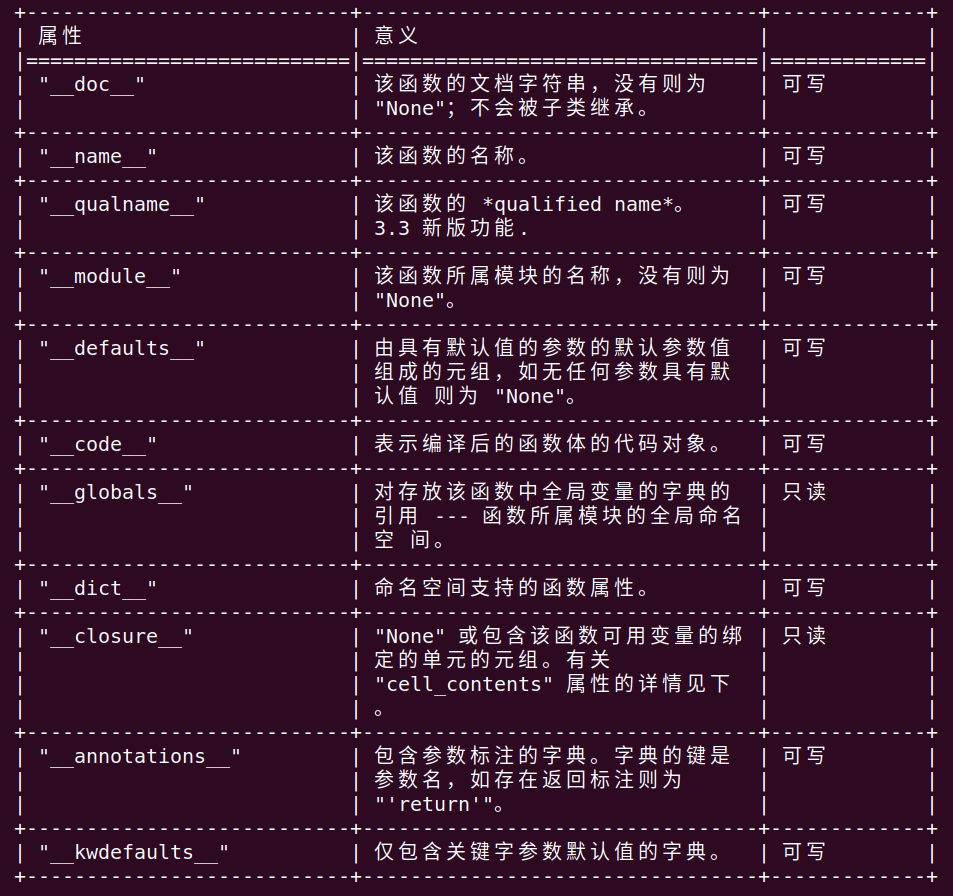


<!-- vim-markdown-toc GFM -->

* [闭包问题](#闭包问题)
	* [python官方文档中的数据模型中的可调用类型：](#python官方文档中的数据模型中的可调用类型)
	* [二. 将一个变量保存到一个函数中](#二-将一个变量保存到一个函数中)
	* [三. 变量作用域：](#三-变量作用域)
	* [链接：](#链接)
	* [python 闭包概念](#python-闭包概念)
	* [闭包的用途](#闭包的用途)

<!-- vim-markdown-toc -->
##  闭包问题
### python官方文档中的数据模型中的可调用类型：
1. 可调用类型
> 此类型可以被应用于函数调用操作 (参见 调用 小节):

	- 用户定义函数
		用户定义函数对象可通过函数定义来创建 (参见 函数定义 小节)。它被
		调用时应附带一个参数列表，其中包含的条目应与函数所定义的形参列表
		一致。

  
      大部分标有 "Writable" 的属性均会检查赋值的类型。

      函数对象也支持获取和设置任意属性，例如这可以被用来给函数附加元数
      据。使用正规的属性点号标注获取和设置此类属性。*注意当前实现仅支
      持用户定义函数属性。未来可能会增加支持内置函数属性。*

      单元对象具有 "cell_contents" 属性。这可被用来获取以及设置单元的
      值。

2. 注意这里的__closure__对象，这个是该函数可用变量的绑定的单元元组。

3. 如果要打印这个值，看下闭包函数绑定了那些值的话，
	1. 闭包中的值保存在返回函数的__closure__的cell object中。

		```
		function_obj.__closure__[0].cell_contents 返回绑定的值
		```

		1. 例子：
			```
			def fun_a(msg):
				def fun_b():
					print("fun_b namespace msg is ", msg)
				return fun_b

			func =fun_a("hello")
			print(func.__closure__[0].cell_contents)

			>>> hello
			```
				
		2. ``func.__closure__``返回cell object组成的元组，每个cell object都是只读的，不可改变。

			```
			func.__closure__[0].cell_contents = "world"
			>>> AttributeError: attribute 'cell_contents' of 'cell' objects is not writable
			
			```

	2. inspect.getclosurevars(function_obj)会比较详细的打印出绑定的值
		
		```
		import inspect

		def a():
			return [lambda :i for i in range(10)]

		d = a()
		e = [j() for j in d]
		print(inspect.getclosurevars(d[0]))
		print(d[0].__closure__[0].cell_contents)

		>>> ClosureVars(nonlocals={'i': 9}, globals={}, builtins={}, unbound=set())
		>>> 9
		```

4. 一个闭包函数绑定了一个变量，会将变量保存到这个```__closure__```元组中。
	延迟绑定就是因为定义函数时，解释器并没有执行函数体，只是执行了定义函数的那一行代码后就离开了函数，
	只有调用函数时解释器才会执行函数体，定义在函数体内的变量只有执行时才会取对应的值。
	所以执行时对应的变量值是多少，就会输出多少。
	
5. 从上面例子可以看出，闭包函数绑定的是```ClosureVars(nonlocals={'i': 9}...) ```,闭包函数的所有对应的i都只是一个值而已。
	应该是离开变量作用域时，才会绑定那个生存周期已经结束的变量的值到__closure__中。

6. nonlocals:参见python faq
	在Python中，仅在函数内引用的变量是隐式全局变量。如果在函数体内的任何位置为变量赋值，则除非明确声明为全局，否则将其视为局部值。

	```
	>>> x = 10
	>>> def foo():
	...     print(x)
	...     x += 1

	会得到一个 UnboundLocalError ：

	>>> foo()
	Traceback (most recent call last):
	  ...
	UnboundLocalError: local variable 'x' referenced before assignment

	```

	1. 这是因为当你对作用域中的变量进行赋值时，该变量将成为该作用域的局部变量，并在外部作用域中隐藏任何类似命名的变量。
		由于foo中的最后一个语句为"x" 分配了一个新值，编译器会将其识别为局部变量。因此，当先前的"print(x)" 尝试打印未初始化的局部变量时会导致错误。
	
7. 子函数改变父函数中的值：
	1. 如果在函数里内函数里面直接msg赋值时可以的，因为此时的msg是``func_b``的locals变量，和``func_a``中的msg没有关系，也改变不了``func_a``中的变量
		
			def fun_a(msg):
			    def fun_b():
			        msg = " world"
			        print("fun_b namespace msg is ", msg)
			    yield fun_b
			    return msg

	2. 在func_b中没有定义新的msg时，直接使用，但接下来改变msg的值，会报错：UnboundLocalError: local variable 'msg' referenced before assignment

			def fun_a(msg):
			    def fun_b():
			        a = msg
			        msg = " world"
			        print("fun_b namespace msg is ", msg)
			    yield fun_b
			    return msg

	3. 只有在func_b使用外面的函数变量时，定义nonlocal，才可以改变外面函数的值，而且这个值是一个引用，更改后即使外面的函数，这个值也修改了。

			def fun_a(msg):
			    def fun_b():
			        nonlocal msg
			        msg += " world"
			        print("fun_b namespace msg is ", msg)
			    yield fun_b
			    return msg
			
			def main():
			    gen = fun_a("hello")
			    msg = yield from gen
			    print("fun_a namespace msg is :", msg)
			
			for func in main():
			    func()

		结果
			fun_b namespace msg is  hello world
			fun_a namespace msg is : hello world
	
	4. 以上的原因：python local 变量定义规则：
		
		1. 当对一个作用域中的变量进行<font color=red>赋值</font>时，该变量将成为该作用域的局部变量，并在外部作用域中隐藏任何类似命名的变量，所以外部变量只可以读，但是不可以赋值，赋值的话，就将变量当做本地变量，屏蔽了外部作用域的变量了，如果没有定义的地方，会报错。
		
		2. 所以在一个作用域中要改变全局变量，必须用global声明变量时全局作用域的，而闭包函数需要nonlocals
		
		3. 使用外部变量导致的问题：

				squares = []
				for x in range(5):
				    squares.append(lambda: x**2)

				>>> squares[2]()
				16
				>>> squares[4]()
				16

				>>> x = 8
				>>> squares[2]()
				64

			1. <font color=red>x不是lambda函数的局部变量，而是函数外边的变量，x这个变量一直存在，lambda执行时才回去读x的值，如果改变x的值，lambda的结果还会变</font>：

					>>> x = 8
					>>> squares[2]()
					64

			2. <font color=green>函数的默认参数都是在定义时就已经初始化好的，所以会导致默认参数是列表的话，函数中会出现错误，而如果函数的参数是外部变量的话，只有当函数调用时，才会确定参数的值。</font>

			3. 避免这个问题，只需要将外部变量变为本地变量，将外部变量赋值给一个本地变量。(函数中一个变量赋值，就会变成本地变量，闭包问题是绑定了外部变量导致的)

					>>> squares = []
					>>> for x in range(5):
					...     squares.append(lambda n=x: n**2)

### 二. 将一个变量保存到一个函数中 

1. 闭包 

		fn = (lambda x: lambda: x)(value)

	这样，fn所代表的的lambda 函数就绑定了value

2. 偏函数
		
		from functools import partial
		a = lambda x: x
		b = partial(a, 234)
		print(b, b(), b.args, b.func, b.keywords)

		结果：
		functools.partial(<function <lambda> at 0x028FC6A8>, 234) 234 (234,) <function <lambda> at 0x028FC6A8> {}

	使用偏函数可以达到同样的目的，只不过偏函数属于另外的类型，不再是简单的函数，偏函数内部保存了参数，不会出现闭包的问题。

### 三. 变量作用域：
1. 如果希望更改全局变量，或者通过改变全局变量来改变函数中的变量使用global
2. 在闭包里面，nonlocal 指定为非本地变量，注意他也不是全局变量

### 链接：
1. [参考链接](https://segmentfault.com/a/1190000008955952)

2. [Python 本地变量错误](https://docs.python.org/2/faq/programming.html#why-am-i-getting-an-unboundlocalerror-when-the-variable-has-a-value)

### python 闭包概念
>在计算机科学中，闭包（Closure）是词法闭包（Lexical Closure）的简称，是引用了自由变量的函数。

1. 这个被引用的自由变量将和这个函数一同存在，即使已经离开了创造它的环境也不例外。

2. 所以，有另一种说法认为闭包是由函数和与其相关的引用环境组合而成的实体。

3. 闭包在运行时可以有多个实例，不同的引用环境和相同的函数组合可以产生不同的实例。

### 闭包的用途
1. 在实际中发现使用到闭包的地方是在事件驱动的地方，事件管理者会根据触发的事件来调用相关处理函数handler，
而handler就可以是闭包的，这样可以只传递给它一个event的参数，但是handler却可以访问到原来命名空间的变量，
如handler是类方法，这样handler可以访问到类对象的所有属性。

