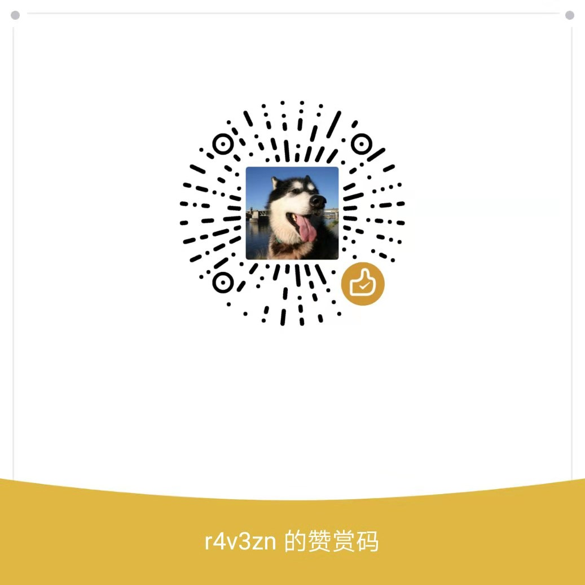
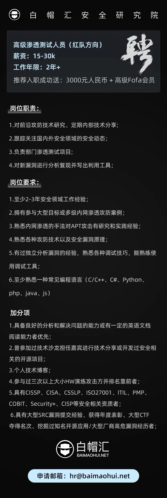

# 前言

## 我为什么要翻译

Celery 在国内，使用的人员很少，可能与 Celery 的文档相关。因为到目前为止，国内没有一个完整的翻译完毕 Celery 的技术使用文档。

## 问题与反馈

如果您觉得本《Celery 中文手册》有翻译问题或不足之处，请通过 GitHub 提交[Issue](https://github.com/open-source-translation/celery-cn/issues)给我，或者发邮件发给我 woo0nise@gmail.com。

Celery 中文手册在翻译的过程中，已经最大限度的保留原手册的英文术语，方便后续的问题排查。

**Celery 中文手册仅限于技术参考。**

## 鼓励一下

所有的赞赏钱钱全部捐献给公益事业以及域名续费，[资金流向](zi-jin-liu-xiang.md)为具体的资金情况。

考虑到捐款的落实情况，准备以后的所有翻译的捐款钱钱全部目前会去捐献给[`韩红基金会`](http://www.hhax.org/)，捐款方式以 Open Source Translation 名义进行捐赠。

## 交流

微信交流群

## 关于翻译版权

### Celery 中文手册

R4v3zn 译

版权所有 © 2019 - , Yu Wang

Celery 中文用户手册基于[Attribution-ShareAlike 4.0 International](https://creativecommons.org/licenses/by-sa/4.0/legalcode)许可证进行发行。

Celery 中文手册被开源在GitHub中[Open Source Translation](https://github.com/open-source-translation)组织中的[celery-cn](https://github.com/open-source-translation/celery-cn)仓库中。

Celery 中文手册：[https://www.celerycn.io/](https://www.celerycn.io/)

Celery 中文手册Github：[https://github.com/open-source-translation/celery-cn](https://github.com/open-source-translation/celery-cn)

Open Source Translation：[https://github.com/open-source-translation](https://github.com/open-source-translation)

GIthub：[https://github.com/0nise](https://github.com/0nise)

博客小站：[https://www.r4v3zn.com](https://www.j2ee.app/)

## 招聘

